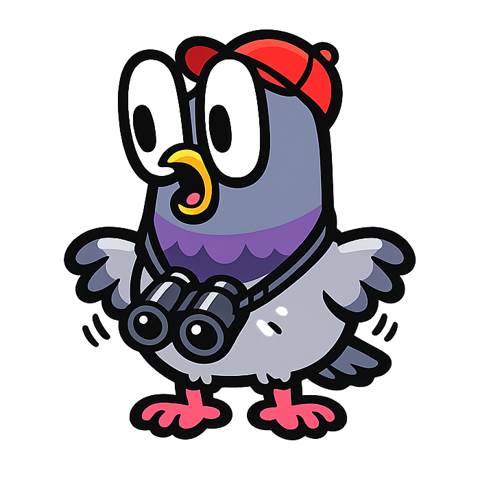
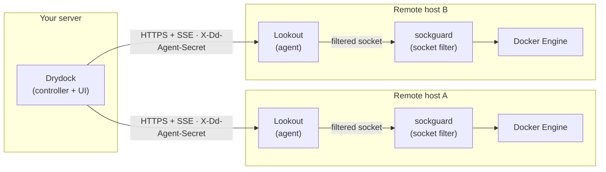

<div align="center">



<h1>Lookout</h1>

**Security-first remote Docker agent — control your containers from anywhere, safely.**


</div>

> [!WARNING]
> ### 🚧 Alpha software — not yet production-ready
> Lookout is in **active alpha** (`v0.2.x`). APIs, environment variables, and on-disk/wire formats may change between minor releases **without notice**. Pin to an exact version, review the [CHANGELOG](CHANGELOG.md) before upgrading, and expect breaking changes before `v1.0.0`.

<p align="center">
  <a href="https://github.com/CodesWhat/lookout/releases"></a>
  <a href="https://github.com/CodesWhat/lookout/pkgs/container/lookout"></a>
  <br>
  <a href="https://github.com/orgs/CodesWhat/packages/container/package/lookout"></a>
  <a href="https://github.com/orgs/CodesWhat/packages/container/package/lookout"></a>
  <a href="LICENSE"></a>
</p>

<p align="center">
  <a href="https://github.com/CodesWhat/lookout/stargazers"></a>
  <a href="https://github.com/CodesWhat/lookout/forks"></a>
  <a href="https://github.com/CodesWhat/lookout/issues"></a>
  <a href="https://github.com/CodesWhat/lookout/commits/main"></a>
  <a href="https://github.com/CodesWhat/lookout/commits/main"></a>
  <br>
  <a href="https://github.com/CodesWhat/lookout"></a>
  
</p>

<p align="center">
  <a href="https://github.com/CodesWhat/lookout/actions/workflows/ci.yml"></a>
  <a href="https://github.com/CodesWhat/lookout/actions/workflows/security-vuln-weekly.yml"></a>
  <a href="https://github.com/CodesWhat/lookout/actions/workflows/quality-fuzz-nightly.yml"></a>
  <br>
  <a href="https://goreportcard.com/report/github.com/codeswhat/lookout"></a>
  <a href="https://pkg.go.dev/github.com/codeswhat/lookout"></a>
  <a href="https://securityscorecards.dev/viewer/?uri=github.com/CodesWhat/lookout"></a>
  <!-- PLACEHOLDER: Snyk is not yet wired up for this repo — replace with a real monitored badge once onboarded -->
  <a href="https://app.snyk.io/org/codeswhat/projects"></a>
</p>

<hr>

<h2 align="center">📑 Contents</h2>

- [🚀 Quick Start](#quick-start)
- [🆕 Recent Updates](#recent-updates)
- [✨ Features](#features)
- [🔐 Authentication](#authentication)
- [🔌 Connection Modes](#connection-modes)
- [🖥️ Standalone Mode](#standalone-generic-mode)
- [⚙️ Configuration](#configuration)
- [📡 API Reference](#api-reference)
- [🔑 Token Security](#token-security)
- [✅ Verify a Release](#verify-a-release)
- [🛡️ Security](#security)
- [📋 Audit Logging](#audit-logging)
- [⭐ Star History](#star-history)
- [🛠️ Built With](#built-with)
- [🤝 Community & Support](#community--support)

<hr>

> [!NOTE]
> **v0.2.0 is the current release.** Ships Ed25519 per-client authentication, key enrollment, Argon2id token hashing, a read-only MCP server, Prometheus metrics, structured audit logging, and hardened CI/supply-chain infrastructure. See [CHANGELOG.md](CHANGELOG.md) for full release notes.



> The Drydock controller connects **inbound** to each Lookout agent over HTTP/HTTPS (it initiates; Lookout serves). Each agent reaches the Docker Engine only through a sockguard socket filter. Outbound **edge mode** (the agent dialing the controller, for hosts with no inbound port) is usable end-to-end as of Drydock 1.5 — see [Connection Modes](#connection-modes).

<h2 align="center" id="quick-start">🚀 Quick Start</h2>

### Recommended deployment (hardened)

The strongest posture combines three controls: **sockguard** (socket-level request filtering so Lookout never touches the raw Docker socket directly), **Ed25519 per-request authentication** (signed requests, replay protection, no shared secrets), and a **hardened container runtime** (`read_only`, `cap_drop: ALL`, `no-new-privileges`, secrets-mounted tokens). Run Lookout in **standard mode strictly behind a TLS reverse proxy** — the Drydock controller connects inbound to it. (Outbound [edge mode](#connection-modes) for hosts with no inbound port is usable end-to-end with Drydock 1.5.)

**Step 1 — generate a token and pull the example:**

```bash
openssl rand -hex 32 > lookout_token.txt
# Download the hardened compose file and its sockguard policy
curl -fsSLO https://raw.githubusercontent.com/CodesWhat/lookout/main/examples/docker-compose.with-sockguard.yml
curl -fsSLO https://raw.githubusercontent.com/CodesWhat/lookout/main/examples/sockguard.yaml
```

**Step 2 — start the hardened stack:**

```bash
docker compose -f docker-compose.with-sockguard.yml up -d
```

This runs sockguard and Lookout as separate containers sharing a filtered socket volume. Neither container has the raw Docker socket mounted directly; sockguard enforces an allowlist of Docker API operations at the socket level. The full compose file (`examples/docker-compose.with-sockguard.yml`):

```yaml
# Lookout + sockguard — two-layer defense.
#
# Sockguard sits between Lookout and the host's Docker socket and writes a
# filtered unix socket into a shared named volume. Lookout talks to that
# filtered socket instead of mounting /var/run/docker.sock directly, so even
# a fully compromised agent is constrained to the explicit API allowlist in
# sockguard.yaml.
#
# Generate a token first:
#   openssl rand -hex 32 > lookout_token.txt

services:
  sockguard:
    image: ghcr.io/codeswhat/sockguard:latest
    restart: unless-stopped
    read_only: true
    cap_drop:
      - ALL
    security_opt:
      - no-new-privileges:true
    volumes:
      - /var/run/docker.sock:/var/run/docker.sock:ro
      - ./sockguard.yaml:/etc/sockguard/sockguard.yaml:ro
      - sockguard-socket:/var/run/sockguard
    environment:
      - SOCKGUARD_LISTEN_SOCKET=/var/run/sockguard/sockguard.sock

  lookout:
    image: ghcr.io/codeswhat/lookout:latest
    restart: unless-stopped
    depends_on:
      - sockguard
    read_only: true
    cap_drop:
      - ALL
    security_opt:
      - no-new-privileges:true
    tmpfs:
      - /tmp
    ports:
      - "3000:3000"
    volumes:
      - sockguard-socket:/var/run/sockguard:ro
      - lookout-stacks:/data/stacks
    environment:
      - DOCKER_SOCKET=/var/run/sockguard/sockguard.sock
      - TOKEN_FILE=/run/secrets/lookout_token
    secrets:
      - lookout_token

secrets:
  lookout_token:
    file: ./lookout_token.txt

volumes:
  sockguard-socket:
  lookout-stacks:
```

**Upgrade to Ed25519 key auth (zero shared secrets):** generate a keypair with `lookout keygen`, mount the `authorized_keys` file, and set `AUTHORIZED_KEYS=/etc/lookout/authorized_keys` — see [Authentication](#authentication). Use `PRIVATE_KEY_FILE` for signed edge-mode hellos.

<details>
<summary>Edge mode variant (outbound WebSocket — early access)</summary>

> **Early access.** Edge mode is usable end-to-end: Drydock 1.5 ships the `/api/lookout/ws` controller endpoint (Ed25519-only) and Lookout signs its hello with an Ed25519 key. Drydock 1.5 and Lookout 0.2.2 are both pre-release; full exec robustness under load lands in Lookout 0.2.2.

For hosts behind NAT or a firewall, [`examples/docker-compose.edge.yml`](examples/docker-compose.edge.yml) has Lookout dial out to your Drydock controller's edge endpoint (`DRYDOCK_URL` + `/api/lookout/ws`); no port is published on the remote host.

```yaml
services:
  lookout:
    image: ghcr.io/codeswhat/lookout:latest
    restart: unless-stopped
    read_only: true
    cap_drop:
      - ALL
    security_opt:
      - no-new-privileges:true
    tmpfs:
      - /tmp
    volumes:
      - /var/run/docker.sock:/var/run/docker.sock:ro
      - lookout-stacks:/data/stacks
    environment:
      - DRYDOCK_URL=https://drydock.example.com
      - TOKEN_FILE=/run/secrets/lookout_token
      - AGENT_NAME=edge-host-01
      # Key-based hello instead of a shared token:
      #   lookout keygen  →  PRIVATE_KEY_FILE=/run/secrets/lookout_key
    secrets:
      - lookout_token

secrets:
  lookout_token:
    file: ./lookout_token.txt

volumes:
  lookout-stacks:
```

</details>

<details>
<summary>Quick start (evaluation only — not for production)</summary>

> **This is for trying Lookout out locally.** Environment-variable tokens are visible in `docker inspect` and process listings. Do not use in production — use the hardened deployment above instead.

```bash
docker run -d \
  --name lookout \
  -v /var/run/docker.sock:/var/run/docker.sock \
  -p 3000:3000 \
  -e TOKEN=$(openssl rand -hex 24) \
  ghcr.io/codeswhat/lookout:latest
```

Without `TOKEN` (or `TOKEN_HASH`/`AUTHORIZED_KEYS`) the API is **unauthenticated** — anyone who can reach the port controls your Docker daemon.

</details>

<details>
<summary>Binary install (install.sh)</summary>

```bash
curl -fsSL https://raw.githubusercontent.com/codeswhat/lookout/main/scripts/install.sh | bash
```

</details>

<hr>

<h2 align="center" id="recent-updates">🆕 Recent Updates</h2>

<details>
<summary><strong>Latest release highlights</strong></summary>

- **v0.2.0 shipped on 2026-06-12** — Ed25519 per-request authentication with signed requests via `X-Lookout-Key-ID` / `X-Lookout-Timestamp` / `X-Lookout-Nonce` / `X-Lookout-Signature` headers, verified against an `authorized_keys` file. Replay protection via nonce LRU and timestamp window, SIGHUP hot-reload of the key file, `lookout keygen` CLI subcommand, and `X-Lookout-Reason` diagnostic header on 401s. Signed edge-mode hello via `PRIVATE_KEY_FILE`.
- **Key enrollment** — optional single-use `ENROLLMENT_TOKEN` (`POST /api/lookout/enroll`) for bootstrapping the first Ed25519 key — burned on first use, rate-limited, and audit-logged.
- **Argon2id token hashing** — `TOKEN_HASH` / `TOKEN_HASH_FILE` with OWASP-recommended parameters; SHA-256 success cache keeps per-request cost flat.
- **MCP server** — read-only Model Context Protocol endpoint at `/_lookout/mcp` (Streamable HTTP, protocol 2025-11-25) for AI assistants (Claude, Cursor, Windsurf). Tools: `list_containers`, `inspect_container`, `container_logs`, `host_metrics`, `container_stats`.
- **Prometheus metrics** — `/metrics` and `/_lookout/metrics` exposing `lookout_build_info`, container count, and host resource metrics.
- **Structured audit logging** — `AUDIT_LOG` env var records auth events, Compose operations, and exec sessions as JSON lines.
- **Generic REST adapter** — headless REST + SSE management API for standalone mode without a Drydock platform connection (`ADAPTER=generic`).
- **Hardened CI & supply chain** — SHA-pinned actions, five Go fuzz targets (60s CI / 5m nightly), integration suite against a real Docker daemon, weekly vulnerability scans (govulncheck/grype/gosec), monthly mutation testing, OpenSSF Scorecard, CodeQL, and cosign keyless signing + CycloneDX SBOM + SLSA provenance on every release.
- **v0.1.0 shipped on 2025-06-01** — initial release: transparent Docker API proxy, Edge mode WebSocket tunnel, Drydock adapter, SSE event stream, token auth, rate limiting, multi-arch image.

See [CHANGELOG.md](CHANGELOG.md) for the full itemized history.

</details>

<hr>

<h2 align="center" id="features">✨ Features</h2>

| | Feature | Description |
|---|---|---|
| 🔄 | **Connection Modes** | Standard mode (the Drydock controller connects inbound over HTTP/SSE) is the primary integration. Edge mode (agent dials out over WebSocket, for NAT/firewalled hosts) is usable end-to-end as of Drydock 1.5 + Lookout 0.2.2 (both pre-release). |
| 🐳 | **Transparent Docker API Proxy** | All Docker Engine API paths forwarded to the local daemon — streaming endpoints, exec session hijacking, and long-lived connections included. |
| 🔑 | **Ed25519 Per-Client Authentication** | Per-request signatures with per-client keys, replay protection via nonce LRU and timestamp window, `authorized_keys`-style rotation via SIGHUP, zero shared secrets. |
| 🔐 | **Argon2id Token Hashing** | Hash your token at rest with OWASP-recommended Argon2id parameters; `TOKEN_HASH_FILE` for Docker secrets support; SHA-256 success cache keeps per-request overhead flat. |
| 🤖 | **MCP Server** | AI assistants connect to `/_lookout/mcp` (Streamable HTTP, protocol 2025-11-25). Read-only tools: `list_containers`, `inspect_container`, `container_logs`, `host_metrics`, `container_stats`. Env variable values are never transmitted. |
| 📦 | **Container Inventory** | Full container metadata with `dd.*` label parsing and SSE broadcasting, including `dd:watcher-snapshot` events for Drydock compatibility. |
| 📈 | **Prometheus Metrics** | Host and per-container CPU/memory/network in cAdvisor-compatible format at `/_lookout/metrics`. Zero external dependencies. |
| 📋 | **Audit Logging** | Structured JSON of every API call, auth event, exec session, and Compose operation. Disabled by default (single nil check overhead when off). |
| 🖥️ | **Host Metrics** | CPU, memory, disk, network, and uptime collection. |
| ⚡ | **Interactive Exec** | Terminal sessions via WebSocket or HTTP hijack with 100 concurrent session cap. |
| 🗂️ | **Docker Compose** | Full lifecycle management with security hardening — path traversal protection, env var denylist, service name injection prevention. |
| 📡 | **SSE Compatibility** | Drop-in replacement for existing Drydock agents, including `dd:watcher-snapshot` full inventory on connect. |
| ✍️ | **Signed Supply Chain** | Cosign keyless signatures, CycloneDX SBOM, and SLSA provenance on every release. Verifiable without managing signing keys. |
| 🛡️ | **Two-Layer Defense** | Pair with [sockguard](https://github.com/codeswhat/sockguard) so the agent never touches the raw Docker socket directly. |
| 🪶 | **Minimal Footprint** | Static Go binary, ~10 MB Wolfi (Chainguard) container image. CGO disabled, stripped, no external runtime dependencies. |
| 🔌 | **Standalone Mode** | `ADAPTER=generic` provides a clean REST + SSE API on `/api/v1/*` backed by the local Docker daemon — no Drydock account required. |

<hr>

<h2 align="center" id="authentication">🔐 Authentication</h2>

<details>
<summary><strong>Token Authentication (quickstart)</strong></summary>

Set `TOKEN` to a random secret. All requests must supply it via
`Authorization: Bearer`, `X-Lookout-Token`, or `X-Dd-Agent-Secret`.

```bash
TOKEN=$(openssl rand -hex 32)
docker run -d --name lookout \
  -v /var/run/docker.sock:/var/run/docker.sock \
  -e TOKEN="$TOKEN" \
  -p 3000:3000 \
  ghcr.io/codeswhat/lookout:latest
```

</details>

<details>
<summary><strong>Ed25519 Per-Client Key Authentication (recommended)</strong></summary>

Ed25519 keypairs give per-client identity with per-request signatures and
replay protection. No shared secrets.

**Generate a keypair:**

```bash
# Writes the private key (PEM PKCS#8) and the authorized_keys line to stdout.
lookout keygen -comment "my-platform:prod"
```

**Copy the `authorized_keys` line to the agent host:**

```
# /etc/lookout/authorized_keys  (mode 0600)
ed25519 AAAA... my-platform:prod
```

**Start the agent with Ed25519 auth:**

```bash
docker run -d --name lookout \
  -v /var/run/docker.sock:/var/run/docker.sock \
  -v /etc/lookout/authorized_keys:/etc/lookout/authorized_keys:ro \
  -e AUTHORIZED_KEYS=/etc/lookout/authorized_keys \
  -p 3000:3000 \
  ghcr.io/codeswhat/lookout:latest
```

**Key rotation (zero-downtime):**

1. Generate a new keypair: `lookout keygen -comment "my-platform:prod:2026-07"`
2. Append the new public key line to the authorized_keys file on the agent host.
3. Send `SIGHUP` to reload: `kill -HUP $(pidof lookout)` or
   `docker kill --signal HUP lookout`. Both old and new keys are now active.
4. Update the platform to use the new private key.
5. Remove the old key from the file and send another `SIGHUP`.

Token auth (`TOKEN`/`TOKEN_HASH`) continues to work alongside Ed25519 — both
can be set simultaneously during migration. The middleware checks for
`X-Lookout-Signature` first; if absent, it falls back to the token check.

</details>

<hr>

<h2 align="center" id="connection-modes">🔌 Connection Modes</h2>

<details>
<summary><strong>Standard Mode and Edge Mode</strong></summary>

### Standard Mode — implemented

Lookout runs an HTTP(S) server; the **Drydock controller connects inbound** and pulls from it. This is the integration that works today.

- Set when `DRYDOCK_URL` is not configured
- Drydock authenticates with the `X-Dd-Agent-Secret` shared secret (optional mTLS)
- Handshake on `GET /api/containers` · `/api/watchers` · `/api/triggers`, then a long-lived **SSE** stream on `GET /api/events`
- Transparent Docker API proxy on all paths; agent endpoints under `/_lookout/*`
- Optional TLS with modern cipher suites (TLS 1.2+)

### Edge Mode — early access

Lookout initiates an outbound WebSocket to the controller's edge endpoint (`DRYDOCK_URL` + `/api/lookout/ws`) for hosts with no inbound port. Both sides are implemented — Drydock 1.5 ships the controller endpoint and Lookout signs an Ed25519 hello — so edge mode is **usable end-to-end**. Drydock 1.5 and Lookout 0.2.2 are pre-release; full exec robustness under load lands in Lookout 0.2.2. The endpoint is **Ed25519-only**: set `PRIVATE_KEY_FILE` and register the public key with Drydock.

- Set when `DRYDOCK_URL` is configured along with `TOKEN`, `AUTHORIZED_KEYS`, or `PRIVATE_KEY_FILE`
- Targets hosts behind NAT, firewalls, and dynamic IPs
- Auto-reconnect with exponential backoff + jitter; signed hello via `PRIVATE_KEY_FILE`

```
DRYDOCK_URL set + (TOKEN or AUTHORIZED_KEYS or PRIVATE_KEY_FILE) set  →  Edge Mode (outbound WebSocket)
Otherwise                                                              →  Standard Mode (inbound HTTP server)
```

</details>

<hr>

<h2 align="center" id="standalone-generic-mode">🖥️ Standalone (Generic) Mode</h2>

<details>
<summary><strong>Run without a Drydock platform connection</strong></summary>

Run Lookout without any external controller by setting `ADAPTER=generic`.
You get a clean REST + SSE API on `/api/v1/*` backed directly by the local
Docker daemon — no Drydock account required.

```bash
docker run -d \
  --name lookout \
  -v /var/run/docker.sock:/var/run/docker.sock \
  -e ADAPTER=generic \
  -e TOKEN=my-secret \
  -p 3000:3000 \
  ghcr.io/codeswhat/lookout:latest
```

### Endpoints

| Endpoint | Description |
|----------|-------------|
| `GET /api/v1/version` | Agent version, protocol info |
| `GET /api/v1/containers` | Cached container inventory |
| `GET /api/v1/containers/{id}/logs` | Container logs (`tail`, `since`, `until`, `follow`) |
| `GET /api/v1/events` | SSE stream of Docker lifecycle events |

### curl examples

```bash
TOKEN=my-secret

# Agent version
curl -s -H "Authorization: Bearer $TOKEN" http://localhost:3000/api/v1/version | jq .

# Container inventory
curl -s -H "Authorization: Bearer $TOKEN" http://localhost:3000/api/v1/containers | jq .

# Last 50 log lines from a container
curl -s -H "Authorization: Bearer $TOKEN" \
  "http://localhost:3000/api/v1/containers/my-container/logs?tail=50"

# Stream container logs live
curl -sN -H "Authorization: Bearer $TOKEN" \
  "http://localhost:3000/api/v1/containers/my-container/logs?follow=1"

# Stream Docker lifecycle events (SSE)
curl -sN -H "Authorization: Bearer $TOKEN" \
  http://localhost:3000/api/v1/events
```

Each SSE event is a JSON object:

```json
{
  "ts": "2026-06-11T10:00:00Z",
  "type": "container",
  "action": "start",
  "containerId": "abc123def456",
  "name": "my-container",
  "image": "nginx:latest",
  "labels": { "app": "web" }
}
```

A comment heartbeat line (`: heartbeat`) is written every 30 seconds to keep
the connection alive through proxies.

</details>

<hr>

<h2 align="center" id="configuration">⚙️ Configuration</h2>

<details>
<summary><strong>Environment variable reference</strong></summary>

### Connection

| Variable | Default | Description |
|----------|---------|-------------|
| `DRYDOCK_URL` | -- | WebSocket URL for Edge mode (`wss://...`) |
| `TOKEN` | -- | Authentication token (plaintext) |
| `TOKEN_FILE` | -- | Path to file containing token |
| `TOKEN_HASH` | -- | Argon2id hash of token (generate with `lookout hash-token`) |
| `TOKEN_HASH_FILE` | -- | Path to file containing Argon2id hash |
| `AUTHORIZED_KEYS` | -- | Path to Ed25519 authorized_keys file (per-client asymmetric auth) |
| `AUTHORIZED_KEYS_FILE` | -- | Alias for `AUTHORIZED_KEYS` |
| `MAX_CLOCK_SKEW_SECONDS` | `60` | Maximum allowed clock skew for Ed25519 request timestamps |
| `NONCE_LRU_SIZE` | `10000` | In-memory nonce cache capacity for replay protection |
| `ENROLLMENT_TOKEN` | -- | One-shot bootstrap token for Model C key enrollment |
| `ENROLLMENT_TOKEN_FILE` | -- | File containing enrollment token |
| `PRIVATE_KEY_FILE` | -- | Ed25519 private key (PEM PKCS#8) for signing edge-mode hello |
| `CA_CERT` | -- | Custom CA certificate for Edge mode |
| `TLS_SKIP_VERIFY` | `false` | Skip TLS verification (testing only) |
| `PORT` | `3000` | HTTP server port |
| `BIND_ADDRESS` | `0.0.0.0` | Bind address |
| `TLS_CERT` | -- | Server TLS certificate (Standard mode) |
| `TLS_KEY` | -- | Server TLS key (Standard mode) |
| `TRUSTED_PROXIES` | -- | Comma-separated CIDRs of reverse proxies whose `X-Forwarded-For` is trusted; unset means forwarding headers are ignored |

### Docker

| Variable | Default | Description |
|----------|---------|-------------|
| `DOCKER_SOCKET` | Auto-detect | Docker socket path |
| `DOCKER_HOST` | -- | Docker TCP host (alternative) |
| `STACKS_DIR` | `/data/stacks` | Compose stack file directory |

### Agent Identity

| Variable | Default | Description |
|----------|---------|-------------|
| `AGENT_ID` | UUID v4 | Unique agent identifier |
| `AGENT_NAME` | Hostname | Human-readable name |

### Operational

| Variable | Default | Description |
|----------|---------|-------------|
| `HEARTBEAT_INTERVAL` | `30` | Ping interval (seconds) |
| `WELCOME_TIMEOUT` | `30` | Seconds to await the Drydock welcome message in edge mode |
| `REQUEST_TIMEOUT` | `30` | Docker API request timeout (seconds) |
| `RECONNECT_DELAY` | `1` | Initial reconnect delay (seconds) |
| `MAX_RECONNECT_DELAY` | `60` | Max reconnect delay (seconds) |
| `LOG_LEVEL` | `info` | `debug`, `info`, `warn`, `error` |
| `SKIP_DF_COLLECTION` | -- | Disable disk metrics |
| `AUDIT_LOG` | -- | Audit log sink: `stdout`, `stderr`, or a file path; unset disables auditing |

### Adapter

| Variable | Default | Description |
|----------|---------|-------------|
| `ADAPTER` | `drydock` | Adapter to use: `drydock` (Drydock-compatible) or `generic` (standalone REST/SSE) |

### Drydock Compatibility

| Variable | Default | Description |
|----------|---------|-------------|
| `DD_AGENT_SECRET` | -- | Backward-compatible auth token |
| `DD_AGENT_SECRET_FILE` | -- | Backward-compatible token file |
| `DD_POLL_INTERVAL` | `300` | Container inventory refresh (seconds) |

</details>

<hr>

<h2 align="center" id="api-reference">📡 API Reference</h2>

<details>
<summary><strong>Health, agent, MCP, Drydock-compatible, and proxy endpoints</strong></summary>

### Health Endpoints

| Endpoint | Method | Auth | Description |
|----------|--------|------|-------------|
| `/health` | GET | No | Simple health check — `{"status":"ok"}` |
| `/_lookout/health` | GET | No | Health check + Docker connectivity |

`/_lookout/health` returns HTTP 503 when the Docker daemon is unreachable.
Both endpoints are unauthenticated and safe to use for load-balancer probes
and Docker HEALTHCHECK instructions.

### Agent Endpoints

| Endpoint | Method | Auth | Description |
|----------|--------|------|-------------|
| `/_lookout/info` | GET | Yes | Agent version, mode, capabilities |
| `/_lookout/compose` | POST | Yes | Docker Compose operations |
| `/_lookout/metrics` | GET | Yes | Prometheus metrics (agent-scoped) |
| `/metrics` | GET | Yes | Prometheus metrics (compat alias) |
| `/_lookout/mcp` | POST | Yes | MCP server (JSON-RPC 2.0, protocol 2025-11-25) |

### MCP — AI Assistant Integration

Lookout exposes a read-only [Model Context Protocol](https://modelcontextprotocol.io/) endpoint
at `POST /_lookout/mcp`. AI assistants (Claude, Cursor, Windsurf, or any MCP client) can query
live container state through this endpoint using their standard tool-call flow.

**Protocol:** MCP 2025-11-25 — Streamable HTTP, stateless single-request mode, `Content-Type: application/json`.

**Available tools:**

| Tool | Description |
|------|-------------|
| `list_containers` | All containers — id, names, image, state, status, labels |
| `inspect_container(id)` | State, image, env-var count (values never exposed), mounts, networks, restart policy |
| `container_logs(id, tail)` | Last N lines of stdout/stderr (max 500) |
| `host_metrics` | CPU, memory, disk, network, uptime snapshot |
| `container_stats(id)` | One-shot CPU/memory/network stats for a container |

**Credential hygiene:** `inspect_container` returns only the *count* of environment variables —
values are never transmitted, preventing accidental secret leakage.

#### Add to Claude Desktop (claude_desktop_config.json)

```json
{
  "mcpServers": {
    "lookout": {
      "command": "curl",
      "args": ["-s", "-X", "POST",
               "-H", "Content-Type: application/json",
               "-H", "Authorization: Bearer YOUR_LOOKOUT_TOKEN",
               "http://your-host:3000/_lookout/mcp"],
      "type": "http",
      "url": "http://your-host:3000/_lookout/mcp",
      "headers": {
        "Authorization": "Bearer YOUR_LOOKOUT_TOKEN"
      }
    }
  }
}
```

#### Add via claude mcp add (CLI)

```bash
claude mcp add --transport http \
  --header "Authorization: Bearer YOUR_LOOKOUT_TOKEN" \
  lookout http://your-host:3000/_lookout/mcp
```

#### .mcp.json (project-level, Cursor / Windsurf / any client)

```json
{
  "mcpServers": {
    "lookout": {
      "type": "http",
      "url": "http://your-host:3000/_lookout/mcp",
      "headers": {
        "Authorization": "Bearer YOUR_LOOKOUT_TOKEN"
      }
    }
  }
}
```

Replace `YOUR_LOOKOUT_TOKEN` with the value you set in `TOKEN` / `TOKEN_FILE` / `TOKEN_HASH`.

### Drydock-Compatible Endpoints

| Endpoint | Method | Description |
|----------|--------|-------------|
| `/api/events` | GET | SSE event stream (`dd:ack`, container events) |
| `/api/containers` | GET | Container inventory |
| `/api/containers/:id/logs` | GET | Container logs |
| `/api/containers/:id` | DELETE | Remove container |
| `/api/watchers` | GET | Watcher components |
| `/api/triggers` | GET | Trigger components |

### Docker API Proxy

All other paths (`/*`) are transparently proxied to the Docker Engine API, including streaming endpoints and exec session hijacking.

### Metrics

Lookout exposes Prometheus metrics at `/_lookout/metrics` (and the alias
`/metrics`). Both require bearer auth.

Prometheus scrape config:

```yaml
scrape_configs:
  - job_name: lookout
    scheme: https          # or http if TLS not configured
    static_configs:
      - targets: ["your-host:3000"]
    authorization:
      type: Bearer
      credentials: YOUR_LOOKOUT_TOKEN
    tls_config:
      # ca_file: /etc/prometheus/lookout-ca.crt  # if using custom CA
      insecure_skip_verify: false
```

</details>

<hr>

<h2 align="center" id="token-security">🔑 Token Security</h2>

<details>
<summary><strong>Plaintext, file-based, and hash-at-rest token options</strong></summary>

### Plaintext token (testing only)

> **Warning:** Environment variables are visible in `docker inspect` and
> process listings. For production, use `TOKEN_FILE` or `TOKEN_HASH_FILE`
> with a mounted secret.

```bash
# Generate a strong token
TOKEN=$(openssl rand -hex 32)
docker run -e TOKEN="$TOKEN" ... ghcr.io/codeswhat/lookout:latest
```

### File-based token (production)

```bash
TOKEN=$(openssl rand -hex 32)
printf '%s' "$TOKEN" > /run/secrets/lookout-token
chmod 600 /run/secrets/lookout-token
docker run -e TOKEN_FILE=/run/secrets/lookout-token \
  -v /run/secrets/lookout-token:/run/secrets/lookout-token:ro \
  ... ghcr.io/codeswhat/lookout:latest
```

### Hash-at-rest with TOKEN_HASH

Store only an Argon2id hash so the plaintext token never appears in env dumps
or config files:

```bash
# Generate the hash (token is read from stdin, never argv)
HASH=$(printf '%s' "$TOKEN" | lookout hash-token)
# $argon2id$v=19$m=19456,t=2,p=1$<salt>$<hash>

# Use the hash instead of the plaintext
docker run -e TOKEN_HASH="$HASH" ... ghcr.io/codeswhat/lookout:latest
```

Or write the hash to a file and use `TOKEN_HASH_FILE`:

```bash
printf '%s' "$TOKEN" | lookout hash-token > /run/secrets/lookout-token-hash
docker run -e TOKEN_HASH_FILE=/run/secrets/lookout-token-hash ...
```

</details>

<hr>

<h2 align="center" id="verify-a-release">✅ Verify a Release</h2>

<details>
<summary><strong>Cosign verification for checksums and container images</strong></summary>

Lookout releases are signed with [Sigstore cosign](https://github.com/sigstore/cosign)
via GitHub Actions keyless signing. Checksums and container images can be
verified without managing signing keys.

### Verify the checksums file

```bash
TAG=v0.1.0

cosign verify-blob \
  --certificate-identity-regexp "https://github.com/CodesWhat/lookout/.github/workflows/.*" \
  --certificate-oidc-issuer "https://token.actions.githubusercontent.com" \
  --bundle "checksums.txt.bundle" \
  "checksums.txt"
```

### Verify the container image

```bash
TAG=v0.1.0

cosign verify \
  --certificate-identity-regexp "https://github.com/CodesWhat/lookout/.github/workflows/.*" \
  --certificate-oidc-issuer "https://token.actions.githubusercontent.com" \
  "ghcr.io/codeswhat/lookout:${TAG}"
```

### SBOM

Each release includes a CycloneDX SBOM attached as a release asset
(`lookout-${TAG}-sbom.cdx.json`). Download and inspect it with any
CycloneDX-compatible tool, or verify it with cosign the same way as the
checksums file.

</details>

<hr>

<h2 align="center" id="security">🛡️ Security</h2>

<details>
<summary><strong>Security model summary</strong></summary>

- **Authentication**: Token-based with timing-safe comparison (`crypto/subtle`); hash-at-rest via `TOKEN_HASH` (Argon2id); Ed25519 per-client keypairs with per-request signatures and replay protection
- **Rate Limiting**: 10 failed auth attempts per IP per minute
- **TLS**: TLS 1.2+ with modern AEAD cipher suites
- **Compose Security**: Path traversal protection, env var denylist, service name injection prevention
- **Resource Limits**: WebSocket (16 MB), response body (100 MB), exec sessions (100 concurrent)

See [docs/security-model.md](docs/security-model.md) for the full citable spec and CVE mapping.

</details>

<hr>

<h2 align="center" id="audit-logging">📋 Audit Logging</h2>

<details>
<summary><strong>Structured JSON audit trail for every security-relevant action</strong></summary>

Lookout ships structured JSON audit logging for every security-relevant action — a feature that commercial container management platforms lock behind paid tiers.

### Enable

```bash
# Write to a file (opened append-only, mode 0600)
docker run -e AUDIT_LOG=/var/log/lookout-audit.log ...

# Or to stdout/stderr (useful with log aggregators)
docker run -e AUDIT_LOG=stdout ...
```

Auditing is disabled by default (`AUDIT_LOG` unset). When disabled the overhead is a single nil pointer check per request.

### Events

| `event` | Triggered when |
|---------|---------------|
| `api_request` | Any authenticated API call completes |
| `auth_failure` | An invalid token is presented |
| `rate_limited` | An IP is blocked by the rate limiter |
| `compose_op` | A Docker Compose operation runs |
| `exec_start` | An interactive exec tunnel opens |

### Sample JSON lines

```json
{"time":"2026-01-15T10:23:45.123456789Z","level":"INFO","msg":"","event":"api_request","actor":"203.0.113.42","method":"POST","path":"/_lookout/compose","outcome":"allowed","status":200,"duration_ms":3.14}
```

Compose operations include additional fields:

```json
{"time":"2026-01-15T10:23:45.200Z","level":"INFO","msg":"","event":"compose_op","actor":"203.0.113.42","operation":"up","stack":"nginx-stack","outcome":"allowed"}
```

Exec tunnel events:

```json
{"time":"2026-01-15T10:24:01.500Z","level":"INFO","msg":"","event":"exec_start","actor":"203.0.113.42","container":"abc123def456","exec_id":"e7f8a9b1","outcome":"allowed"}
```

</details>

<hr>

<h2 align="center" id="documentation">📖 Documentation</h2>

| Resource | Link |
| --- | --- |
| Security Model | [`docs/security-model.md`](docs/security-model.md) |
| Ed25519 Auth Design | [`docs/design/ed25519-auth.md`](docs/design/ed25519-auth.md) |
| Watchtower Migration | [`docs/migrating-from-watchtower.md`](docs/migrating-from-watchtower.md) |
| Drydock Integration | [`docs/drydock-integration.md`](docs/drydock-integration.md) |
| OpenAPI Spec | [`api/openapi.yaml`](api/openapi.yaml) |
| Changelog | [`CHANGELOG.md`](CHANGELOG.md) |
| Contributing | [`CONTRIBUTING.md`](CONTRIBUTING.md) |
| Code of Conduct | [`CODE_OF_CONDUCT.md`](CODE_OF_CONDUCT.md) |
| Security Policy | [`SECURITY.md`](SECURITY.md) |
| Releasing | [`RELEASING.md`](RELEASING.md) |
| Examples | [`examples/`](examples/) |
| Issues | [GitHub Issues](https://github.com/CodesWhat/lookout/issues) |
| Discussions | [GitHub Discussions](https://github.com/CodesWhat/lookout/discussions) |

<hr>

<a id="star-history"></a>

<div align="center">
  <a href="https://star-history.com/#CodesWhat/lookout&Date">
    
  </a>
</div>

---

<div align="center">

[](https://semver.org/)
[](https://www.conventionalcommits.org/)
[](https://keepachangelog.com/)

### Built With

[](https://go.dev/)
[](https://github.com/gorilla/websocket)
[](https://github.com/google/uuid)
[](https://pkg.go.dev/golang.org/x/crypto)
[](https://www.sigstore.dev/)
[](https://edu.chainguard.dev/open-source/wolfi/overview/)
[](https://www.docker.com/)
[](https://goreleaser.com/)

### Community & Support

Issues, ideas, and pull requests are welcome. Start with [CONTRIBUTING.md](CONTRIBUTING.md), use [SECURITY.md](SECURITY.md) for private vulnerability disclosure, and use [GitHub Discussions](https://github.com/CodesWhat/lookout/discussions) for design questions.

Every release image is cosign-signed via GitHub Actions OIDC. Before running a Lookout image in production, verify it with the canonical invocation in the [Verify a Release](#verify-a-release) section above.

**[AGPL-3.0 License](LICENSE)**

Built by <a href="https://codeswhat.com">CodesWhat</a>

[](https://ko-fi.com/codeswhat)
[](https://buymeacoffee.com/codeswhat)
[](https://github.com/sponsors/CodesWhat)

<a href="#lookout">Back to top</a>

</div>
