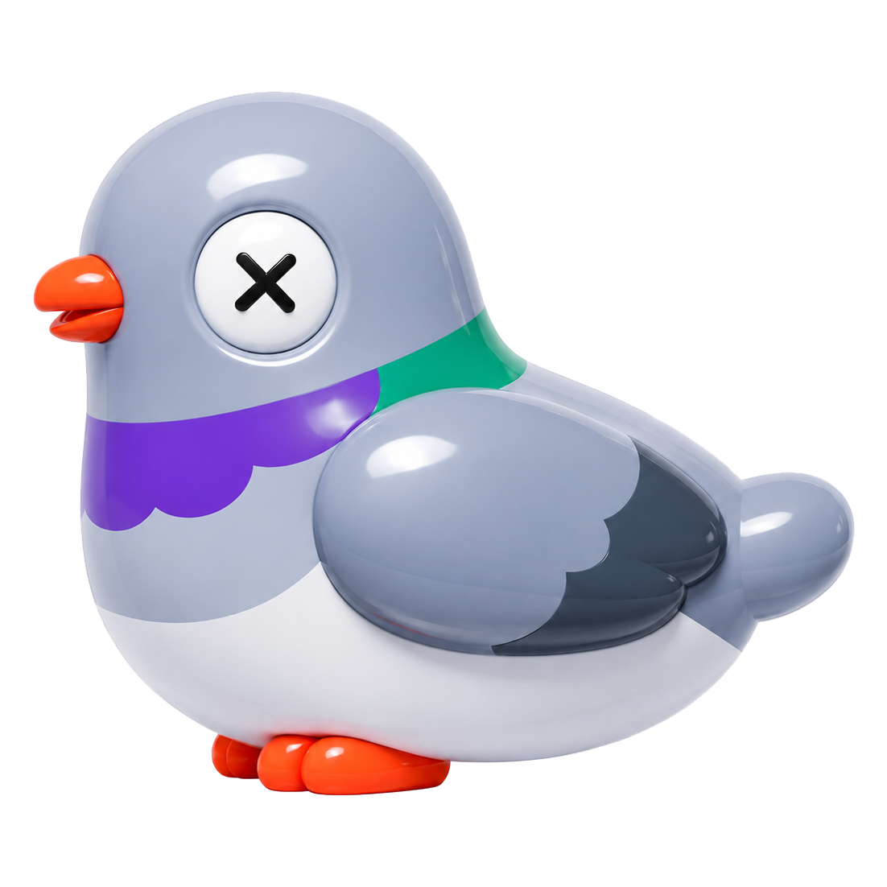
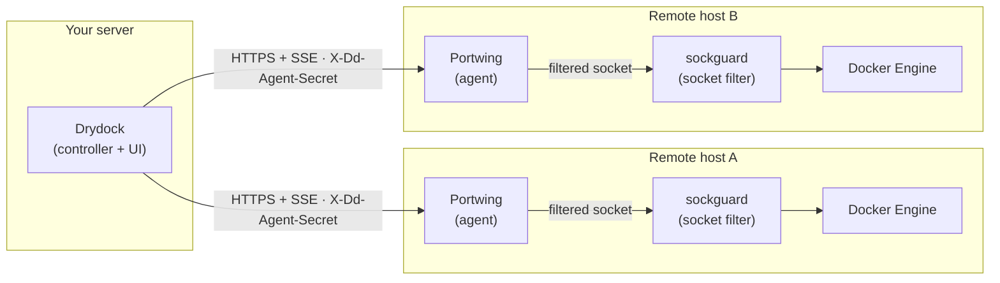
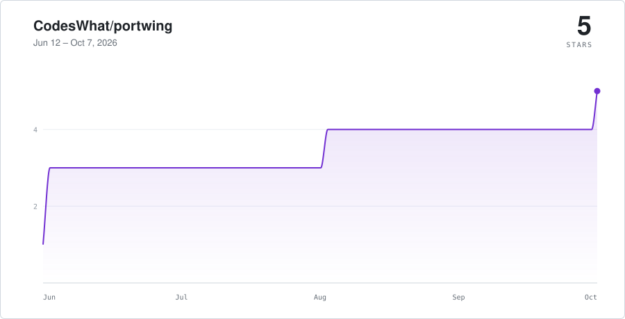

<div align="center">

<picture>
  <source media="(prefers-color-scheme: dark)" srcset="portwing-dark.png" />
  <source media="(prefers-color-scheme: light)" srcset="portwing.png" />
  
</picture>

<h1>Portwing</h1>

**Security-first remote Docker agent — control your containers from anywhere, safely.**

</div>

<p align="center">
  <a href="https://github.com/CodesWhat/portwing/releases"></a>
  <a href="https://github.com/orgs/CodesWhat/packages/container/package/portwing"></a>
  <a href="LICENSE"></a>
  <br>
  <a href="https://github.com/CodesWhat/portwing/actions/workflows/ci-verify.yml"></a>
  <a href="https://securityscorecards.dev/viewer/?uri=github.com/CodesWhat/portwing"></a>
  <a href="https://www.bestpractices.dev/projects/14029"></a>
  <a href="https://qlty.sh/gh/CodesWhat/projects/portwing"></a>
  <a href="https://codecov.io/gh/CodesWhat/portwing"></a>
  <a href="https://github.com/CodesWhat/portwing/actions/workflows/quality-fuzz-nightly.yml"></a>
  <br>
  <a href="https://github.com/CodesWhat/portwing/releases"></a>
  <a href="https://github.com/orgs/CodesWhat/packages/container/package/portwing"></a>
  <a href="https://github.com/sponsors/CodesWhat"></a>
</p>

<hr>

> [!WARNING]
> **Pre-1.0 software — APIs may still change.** Portwing is pre-`v1.0.0` (currently `v0.9.25`). The compatibility guarantees that already apply are published in [STABILITY.md](STABILITY.md); other surfaces may still change between minor releases. Pin to an exact version and review the [CHANGELOG](CHANGELOG.md) before upgrading.

<!-- separate alerts: a blank-line-only gap between blockquotes trips markdownlint MD028 -->

> [!NOTE]
> **v0.9.25 is the current release.** It is built with Go 1.27.2, which fixes 13 standard-library advisories; ten of them were reachable from Portwing's code in the previous release, so upgrading is recommended. Binary request uploads require a controller that implements the negotiated `edge-request-body-stream` capability. Wire compatibility remains `portwing/1.0` and `DrydockCompat` 1.4.0; full watcher/update feature compatibility requires Drydock `v1.6.0-rc.11+`. See [CHANGELOG.md](CHANGELOG.md) for the full itemized history.

<h2 align="center">Contents</h2>

- [Documentation](#documentation)
- [Quick Start](#quick-start)
- [Why Portwing](#why-portwing)
- [Features](#features)
- [Feature Comparison](#feature-comparison)
- [Roadmap](#roadmap)
- [Star History](#star-history)
- [Built With](#built-with)
- [Community & Support](#community-support)
- [CodesWhat Ecosystem](#codeswhat-ecosystem)

<hr>

<h2 align="center" id="documentation">Documentation</h2>

| Resource | Link |
| --- | --- |
| Website | [portwing.codeswhat.com](https://portwing.codeswhat.com) |
| Docs | [portwing.codeswhat.com/docs](https://portwing.codeswhat.com/docs) |
| Getting Started | [Getting Started](https://portwing.codeswhat.com/docs/getting-started) |
| Installation | [Native packages and install guide](https://portwing.codeswhat.com/docs/installation) |
| Authentication | [Token, hash-at-rest, and Ed25519 keys](https://portwing.codeswhat.com/docs/authentication) |
| Connection Modes | [Standard and Edge](https://portwing.codeswhat.com/docs/connection-modes) |
| Standalone Mode | [Generic REST and SSE adapter](https://portwing.codeswhat.com/docs/standalone-mode) |
| Configuration | [Environment variable reference](https://portwing.codeswhat.com/docs/configuration) |
| API Reference | [HTTP endpoints](https://portwing.codeswhat.com/docs/api-reference) |
| MCP Server | [AI assistant integration and client setup](https://portwing.codeswhat.com/docs/mcp-server) |
| Observability | [Prometheus metrics and health endpoints](https://portwing.codeswhat.com/docs/observability) |
| Audit Logging | [Structured audit trail](https://portwing.codeswhat.com/docs/audit-logging) |
| Verifying Releases | [Cosign, attestations, checksums, SBOM](https://portwing.codeswhat.com/docs/verification) |
| Security Model | [Website](https://portwing.codeswhat.com/docs/security-model), [`docs/security-model.md`](docs/security-model.md) |
| Stability Policy | [Website](https://portwing.codeswhat.com/docs/stability-policy), [`STABILITY.md`](STABILITY.md), [`COMPATIBILITY.md`](COMPATIBILITY.md) |
| Competitive Landscape | [portwing.codeswhat.com/docs/competitive-landscape](https://portwing.codeswhat.com/docs/competitive-landscape) |
| Drydock Integration | [`docs/drydock-integration.md`](docs/drydock-integration.md) |
| Watchtower Migration | [`docs/migrating-from-watchtower.md`](docs/migrating-from-watchtower.md) |
| Ed25519 Auth Design | [`docs/design/ed25519-auth.md`](docs/design/ed25519-auth.md) |
| Benchmarks | [`BENCHMARKS.md`](BENCHMARKS.md) |
| OpenAPI Spec | [`api/openapi.yaml`](api/openapi.yaml) |
| Changelog | [`CHANGELOG.md`](CHANGELOG.md) |
| Roadmap | See [Roadmap](#roadmap) section below |
| Contributing | [`CONTRIBUTING.md`](CONTRIBUTING.md) |
| Code of Conduct | [Contributor Covenant 2.1](CODE_OF_CONDUCT.md) |
| Governance | [`GOVERNANCE.md`](GOVERNANCE.md) |
| Security Assurance | [`SECURITY-ASSURANCE.md`](SECURITY-ASSURANCE.md) |
| Security Policy | [`SECURITY.md`](SECURITY.md) |
| Releasing | [`RELEASING.md`](RELEASING.md) |
| Examples | [`examples/`](examples/) |
| Issues | [GitHub Issues](https://github.com/CodesWhat/portwing/issues) |
| Discussions | [GitHub Discussions](https://github.com/CodesWhat/portwing/discussions) |

<hr>

<h2 align="center" id="quick-start">Quick Start</h2>

**Recommended: the hardened deployment.** It combines three controls: **sockguard** (socket-level request filtering so Portwing never touches the raw Docker socket), **Ed25519 authentication** (signed requests or the required signed edge hello, with replay protection and no shared secret), and a **hardened container runtime** (`read_only`, `cap_drop: ALL`, `no-new-privileges`, secrets-mounted credentials). The plaintext examples publish port 3000 only on host loopback. For remote access, either configure Portwing TLS before widening that bind, or keep the plaintext listener private behind a TLS-terminating reverse proxy. Use [edge mode](https://portwing.codeswhat.com/docs/connection-modes) when the host must dial out, and Drydock `v1.6.0-rc.11+` for the complete v0.9 watcher/update contract.

**Step 1 — generate a token and pull the example:**

```bash
openssl rand -hex 32 > portwing_token.txt
sudo chown 65532:65532 portwing_token.txt && sudo chmod 0400 portwing_token.txt
export DOCKER_SOCK_GID=$(stat -c '%g' /var/run/docker.sock)
# Download the hardened compose file and its sockguard policy
curl -fsSLO https://raw.githubusercontent.com/CodesWhat/portwing/main/examples/docker-compose.with-sockguard.yml
curl -fsSLO https://raw.githubusercontent.com/CodesWhat/portwing/main/examples/sockguard.yaml
```

**Step 2 — start the hardened stack:**

```bash
docker compose -f docker-compose.with-sockguard.yml up -d
```

This runs sockguard and Portwing as separate containers sharing a filtered socket volume. Neither container has the raw Docker socket mounted directly; sockguard enforces an allowlist of Docker API operations at the socket level.

<details>
<summary>Full compose file (<code>examples/docker-compose.with-sockguard.yml</code>)</summary>

```yaml
# Portwing + sockguard — two-layer defense.
#
# Sockguard sits between Portwing and the host's Docker socket and writes a
# filtered unix socket into a shared named volume. Portwing talks to that
# filtered socket instead of mounting /var/run/docker.sock directly, so even
# a fully compromised agent is constrained to the explicit API allowlist in
# sockguard.yaml.
#
# Generate a token first and make it readable by the container user:
#   openssl rand -hex 32 > portwing_token.txt
#   sudo chown 65532:65532 portwing_token.txt && sudo chmod 0400 portwing_token.txt
#
# Both images run as UID 65532. Sockguard needs the numeric group ID of the
# host Docker socket to open it:
#   export DOCKER_SOCK_GID=$(stat -c '%g' /var/run/docker.sock)
# Portwing itself needs no group_add here — it talks only to sockguard's
# filtered socket, which sockguard creates 0600 under the same UID.
# This plaintext example publishes only on host loopback. For remote access,
# configure Portwing TLS before changing this bind, or keep the plaintext
# listener private behind a TLS-terminating reverse proxy.

services:
  sockguard:
    image: ghcr.io/codeswhat/sockguard:latest
    restart: unless-stopped
    read_only: true
    cap_drop:
      - ALL
    security_opt:
      - no-new-privileges:true
    group_add:
      - "${DOCKER_SOCK_GID:?set to the GID of /var/run/docker.sock (see header)}"
    volumes:
      - /var/run/docker.sock:/var/run/docker.sock:ro
      - ./sockguard.yaml:/etc/sockguard/sockguard.yaml:ro
      - sockguard-socket:/var/run/sockguard
    environment:
      - SOCKGUARD_LISTEN_SOCKET=/var/run/sockguard/sockguard.sock

  portwing:
    image: ghcr.io/codeswhat/portwing:0.9.25
    restart: unless-stopped
    depends_on:
      - sockguard
    read_only: true
    cap_drop:
      - ALL
    security_opt:
      - no-new-privileges:true
    tmpfs:
      - /tmp
    user: "65532:65532"  # image default; explicit so it survives image overrides
    ports:
      - "127.0.0.1:3000:3000"
    volumes:
      - sockguard-socket:/var/run/sockguard:ro
      - portwing-stacks:/data/stacks
    environment:
      - DOCKER_SOCKET=/var/run/sockguard/sockguard.sock
      - TOKEN_FILE=/run/secrets/portwing_token
    secrets:
      - portwing_token

secrets:
  portwing_token:
    file: ./portwing_token.txt

volumes:
  sockguard-socket:
  portwing-stacks:
```

The `sockguard.yaml` preset above (a copy of sockguard's `portwing.yaml`) denies all exec. If Drydock's edge exec feature is in play, use [`examples/docker-compose.edge-with-exec.yml`](examples/docker-compose.edge-with-exec.yml) instead, which pairs edge mode with sockguard's `portwing-with-exec.yaml` preset (`examples/sockguard-with-exec.yaml`). See the [Drydock integration](docs/drydock-integration.md) notes for how denial reasons reach the controller.

**Upgrade to Ed25519 key auth (zero shared secrets):** generate a keypair with `portwing keygen`, mount the `authorized_keys` file, and set `AUTHORIZED_KEYS=/etc/portwing/authorized_keys`. Use `PRIVATE_KEY_FILE` for signed edge-mode hellos. See [Authentication](https://portwing.codeswhat.com/docs/authentication).

</details>

<details>
<summary>Edge mode variant (outbound WebSocket — stable portwing/1.0)</summary>

> **Production supported.** Edge mode uses the stable `portwing/1.0` protocol and is covered by Drydock's cross-repo `quality-portwing-fleet-soak.yml` workflow: real Portwing processes under multi-agent reconnect, exec, backpressure, and continuous-log load. Portwing's separate `quality-soak-weekly.yml` covers the Standard/generic HTTP path and SSE churn under an RSS-growth budget. Use Drydock `v1.6.0-rc.11+` for full v0.9 watcher/update feature compatibility; older controllers may remain wire-compatible without that behavior.

For hosts behind NAT or a firewall, [`examples/docker-compose.edge.yml`](examples/docker-compose.edge.yml) has Portwing dial out to your Drydock controller's edge endpoint (`DRYDOCK_URL` + `/api/portwing/ws`); no port is published on the remote host.

Edge mode is Ed25519-only — generate a keypair first and register the public key with Drydock (`POST /api/v1/portwing/keys`):

```bash
portwing keygen -comment "edge-host-01" > portwing_ed25519.pem
sudo chown 65532:65532 portwing_ed25519.pem && sudo chmod 0400 portwing_ed25519.pem
```

```yaml
services:
  portwing:
    image: ghcr.io/codeswhat/portwing:0.9.25
    restart: unless-stopped
    read_only: true
    cap_drop:
      - ALL
    security_opt:
      - no-new-privileges:true
    tmpfs:
      - /tmp
    volumes:
      - /var/run/docker.sock:/var/run/docker.sock:ro
      - portwing-stacks:/data/stacks
    environment:
      - DRYDOCK_URL=https://drydock.example.com
      - PRIVATE_KEY_FILE=/run/secrets/portwing_key
      - AGENT_NAME=edge-host-01
    secrets:
      - portwing_key

secrets:
  portwing_key:
    file: ./portwing_ed25519.pem

volumes:
  portwing-stacks:
```

</details>

<details>
<summary>Native packages (Homebrew, deb, rpm)</summary>

Stable releases also ship a Homebrew cask plus signed/checksummed `deb` and
`rpm` packages for `amd64`, `arm64`, and `armv7`.

```bash
# macOS
brew install --cask codeswhat/tap/portwing

# Debian/Ubuntu (after downloading the matching release asset)
sudo apt install ./portwing_0.9.25_linux_amd64.deb

# Fedora/RHEL (after downloading the matching release asset)
sudo rpm --install ./portwing_0.9.25_linux_amd64.rpm
```

Packages install the command and, on Linux, a hardened `portwing.service`; they
do not start it before authentication is configured. See the
[native installation guide](https://portwing.codeswhat.com/docs/installation)
for artifact verification, configuration, upgrade, uninstall, and service-user
expectations.

</details>

<details>
<summary>Quick start (evaluation only — not for production)</summary>

> **This is for trying Portwing out locally.** Environment-variable tokens are visible in `docker inspect` and process listings. Do not use in production — use the hardened deployment above instead.

```bash
docker run -d \
  --name portwing \
  --group-add $(stat -c '%g' /var/run/docker.sock) \
  -v /var/run/docker.sock:/var/run/docker.sock \
  -p 127.0.0.1:3000:3000 \
  -e TOKEN=$(openssl rand -hex 24) \
  ghcr.io/codeswhat/portwing:0.9.25
```

Portwing now fails closed: Standard mode refuses to start without `TOKEN`,
`TOKEN_HASH`, or `AUTHORIZED_KEYS`. For local-only development, an explicitly
unauthenticated loopback listener requires `ALLOW_UNAUTHENTICATED=true` and
`BIND_ADDRESS=127.0.0.1` (or `::1`). A non-loopback unauthenticated listener
additionally requires `ALLOW_UNAUTHENTICATED_REMOTE=true`; never use that
second override on a shared or production network.

The image runs as the non-root `portwing` user (UID 65532); `--group-add` grants it the Docker socket's group so it can reach the daemon.

</details>

<details>
<summary>Binary install (install.sh)</summary>

```bash
curl -fsSL https://raw.githubusercontent.com/codeswhat/portwing/main/scripts/install.sh | bash
```

The generated standard-mode config binds to `127.0.0.1`. Keep that listener
private behind a TLS-terminating reverse proxy, or configure Portwing TLS before
changing the bind for remote access.

</details>

Every release image is cosign-signed. Verify the signature before running Portwing in production: see [Verifying Releases](https://portwing.codeswhat.com/docs/verification). Report vulnerabilities privately through [SECURITY.md](SECURITY.md).

See the [Getting Started guide](https://portwing.codeswhat.com/docs/getting-started) for Docker Compose, TLS, and Sockguard variants. What changed in each release is in [`CHANGELOG.md`](CHANGELOG.md) and on the [GitHub Releases](https://github.com/CodesWhat/portwing/releases) page.

<hr>

<h2 align="center" id="why-portwing">Why Portwing</h2>

Controlling a remote Docker host usually means exposing the Docker socket, or running an agent that mounts it directly. Portwing is a small static Go agent that sits in front of the daemon instead. It is a transparent Docker API proxy with per-client Ed25519 authentication, fail-closed startup, structured audit logging, and signed releases, and it pairs with sockguard so the agent never touches the raw Docker socket.

It works for Drydock, which connects inbound to a standard-mode agent or accepts an outbound edge-mode tunnel from hosts behind NAT, and it runs standalone with a REST + SSE API when no controller is involved.


```mermaid
flowchart LR
    subgraph server ["Your server"]
        DD["Drydock<br/>(controller + UI)"]
    end

    subgraph hostA ["Remote host A"]
        direction LR
        LA["Portwing<br/>(agent)"]
        SGA["sockguard<br/>(socket filter)"]
        DA["Docker Engine"]
        LA -- "filtered socket" --> SGA --> DA
    end

    subgraph hostB ["Remote host B"]
        direction LR
        LB["Portwing<br/>(agent)"]
        SGB["sockguard<br/>(socket filter)"]
        DB["Docker Engine"]
        LB -- "filtered socket" --> SGB --> DB
    end

    DD -- "HTTPS + SSE · X-Dd-Agent-Secret" --> LA
    DD -- "HTTPS + SSE · X-Dd-Agent-Secret" --> LB
```

> The Drydock controller connects **inbound** to each standard-mode Portwing agent over HTTP/HTTPS (it initiates; Portwing serves). Each agent reaches the Docker Engine only through a sockguard socket filter. In production-supported **edge mode**, the agent instead dials Drydock over the stable `portwing/1.0` WebSocket tunnel, so no inbound control port needs publishing. Full v0.9 watcher/update integration requires Drydock `v1.6.0-rc.11+`. Keep the separate unauthenticated operations listener private — see [Connection Modes](https://portwing.codeswhat.com/docs/connection-modes).

<hr>

<h2 align="center" id="features">Features</h2>

| | Feature | Description |
|---|---|---|
| 🔀 | **Connection Modes** | Standard mode lets Drydock connect inbound over HTTP/SSE. Production-supported edge mode lets the agent dial outbound over the stable `portwing/1.0` WebSocket tunnel for NAT/firewalled hosts; full v0.9 watcher/update support requires Drydock `v1.6.0-rc.11+`. |
| 🔁 | **Transparent Docker API Proxy** | All Docker Engine API paths forwarded to the local daemon — streaming endpoints, exec session hijacking, and long-lived connections included. |
| 🔑 | **Ed25519 Per-Client Authentication** | Per-request signatures with per-client keys, replay protection via nonce LRU and timestamp window, `authorized_keys`-style rotation via SIGHUP, zero shared secrets. |
| 🔒 | **Argon2id Token Hashing** | Hash your token at rest with OWASP-recommended Argon2id parameters; `TOKEN_HASH_FILE` for Docker secrets support; SHA-256 success cache keeps per-request overhead flat. |
| 🤖 | **MCP Server** | AI assistants connect to `/_portwing/mcp` (Streamable HTTP, protocol revisions 2026-07-28 and 2025-11-25). Read-only tools: `list_containers`, `inspect_container`, `container_logs`, `host_metrics`, `container_stats`. Env variable values are never transmitted. |
| 📦 | **Container Inventory** | Full container metadata with `dd.*` label parsing and SSE broadcasting. Portwing marks watcher execution as controller-owned so compatible Drydock runs native watcher/update calls through the Standard or Edge Docker proxy. |
| 📈 | **Prometheus Metrics** | Host and per-container CPU/memory/network in cAdvisor-compatible format at `/_portwing/metrics`. Zero external dependencies. |
| 📜 | **Audit Logging** | Structured JSON of every authenticated API call, auth event, exec session, and Compose operation. Recent records are retained in memory by default; file/stdout/stderr persistence is opt-in. |
| 🖥️ | **Host Metrics** | CPU, memory, disk, network, and uptime collection. |
| ⌨️ | **Interactive Exec** | Terminal sessions via WebSocket or HTTP hijack with a default cap of 100 concurrent sessions. |
| 🗂️ | **Docker Compose** | Full lifecycle management with security hardening — path traversal protection, env var denylist, service name injection prevention. |
| 📡 | **SSE Compatibility** | Drop-in replacement for existing Drydock agents, including `dd:watcher-snapshot` full inventory on connect. |
| ✍️ | **Signed Supply Chain** | Cosign keyless signatures, per-archive CycloneDX SBOMs, an image SBOM attestation, and SLSA Build L2 provenance on every release. Verifiable without managing signing keys. |
| 🛡️ | **Two-Layer Defense** | Pair with [sockguard](https://github.com/codeswhat/sockguard) so the agent never touches the raw Docker socket directly. |
| 🪶 | **Minimal Footprint** | Static Go binary (~10 MB). Compressed container image: ~45 MB amd64 and ~41 MB arm64 (Wolfi, Chainguard), ~33 MB arm/v7 (Alpine). CGO disabled, stripped, no external runtime dependencies. |
| 🧩 | **Standalone Mode** | `ADAPTER=generic` provides a clean REST + SSE API on `/api/v1/*` backed by the local Docker daemon — no Drydock account required. |

<hr>

<h2 align="center" id="feature-comparison">Feature Comparison</h2>

<details>
<summary><strong>How does Portwing compare to other remote Docker agents?</strong></summary>

> ✅ = supported &nbsp; ❌ = not supported &nbsp; ⚠️ = partial / limited &nbsp; ? = not documented or not evaluated &nbsp; † = archived, no longer maintained

<h4 align="center">Remote Docker agents</h4>

<table>
<thead>
<tr>
<th width="32%">Feature</th>
<th width="13.6%" align="center">Portwing</th>
<th width="13.6%" align="center">Portainer Agent</th>
<th width="13.6%" align="center">Komodo Periphery</th>
<th width="13.6%" align="center">Arcane Agent</th>
<th width="13.6%" align="center">Hawser</th>
</tr>
</thead>
<tbody>
<tr><td>Transparent Docker API proxy</td><td align="center">✅</td><td align="center">✅</td><td align="center">❌</td><td align="center">❌</td><td align="center">✅</td></tr>
<tr><td>Inbound (controller-to-agent) connection</td><td align="center">✅</td><td align="center">✅</td><td align="center">✅</td><td align="center">✅</td><td align="center">✅</td></tr>
<tr><td>Outbound edge connection</td><td align="center">✅</td><td align="center">✅</td><td align="center">✅</td><td align="center">✅</td><td align="center">✅</td></tr>
<tr><td>Per-request signed HTTP authentication</td><td align="center">✅</td><td align="center">?</td><td align="center">?</td><td align="center">?</td><td align="center">?</td></tr>
<tr><td>Optional mTLS for the agent link</td><td align="center">❌</td><td align="center">⚠️</td><td align="center">?</td><td align="center">✅</td><td align="center">?</td></tr>
<tr><td>Default-deny socket filter in the documented deployment</td><td align="center">✅ (with Sockguard)</td><td align="center">❌</td><td align="center">❌</td><td align="center">⚠️</td><td align="center">❌</td></tr>
<tr><td>Agent-level structured audit log</td><td align="center">✅</td><td align="center">⚠️</td><td align="center">⚠️</td><td align="center">⚠️</td><td align="center">⚠️</td></tr>
<tr><td>Prometheus scrape endpoint on the agent</td><td align="center">✅</td><td align="center">?</td><td align="center">?</td><td align="center">?</td><td align="center">?</td></tr>
<tr><td>Read-only MCP server</td><td align="center">✅</td><td align="center">?</td><td align="center">?</td><td align="center">?</td><td align="center">?</td></tr>
<tr><td>Signed release evidence (cosign, SBOM, provenance)</td><td align="center">✅</td><td align="center">⚠️</td><td align="center">⚠️</td><td align="center">⚠️</td><td align="center">⚠️</td></tr>
<tr><td>Fleet UI and controller workflows</td><td align="center">❌</td><td align="center">✅</td><td align="center">✅</td><td align="center">✅</td><td align="center">?</td></tr>
<tr><td>License</td><td align="center">AGPL-3.0</td><td align="center">Zlib (agent) / proprietary Business features</td><td align="center">GPL-3.0</td><td align="center">BSD-3-Clause</td><td align="center">MIT</td></tr>
</tbody>
</table>

> Full v0.9 watcher/update behavior needs Drydock `v1.6.0-rc.11+`. The edge connection itself works with Drydock 1.6.x, or 1.5.x with `DD_EXPERIMENTAL_PORTWING=true`; see [COMPATIBILITY.md](COMPATIBILITY.md). Portwing has no RBAC, GitOps or Swarm support by design; the fleet product features belong in Drydock.

<h4 align="center">Update tools</h4>

<table>
<thead>
<tr>
<th width="40%">Feature</th>
<th width="20%" align="center">Portwing</th>
<th width="20%" align="center">Diun</th>
<th width="20%" align="center"><em>Watchtower&nbsp;†</em></th>
</tr>
</thead>
<tbody>
<tr><td>Remote Docker API proxy</td><td align="center">✅</td><td align="center">❌</td><td align="center">❌</td></tr>
<tr><td>Authenticated remote access</td><td align="center">✅</td><td align="center">❌</td><td align="center">❌</td></tr>
<tr><td>Structured audit log</td><td align="center">✅</td><td align="center">❌</td><td align="center">❌</td></tr>
<tr><td>Default-deny socket filter in the documented deployment</td><td align="center">✅ (with Sockguard)</td><td align="center">❌</td><td align="center">❌</td></tr>
<tr><td>Read-only MCP server</td><td align="center">✅</td><td align="center">?</td><td align="center">?</td></tr>
<tr><td>Outbound edge / NAT tunnel</td><td align="center">✅</td><td align="center">❌</td><td align="center">❌</td></tr>
<tr><td>Image update detection or auto-update</td><td align="center">❌</td><td align="center">✅</td><td align="center">✅</td></tr>
<tr><td>Single lightweight Go binary</td><td align="center">✅</td><td align="center">✅</td><td align="center">✅</td></tr>
<tr><td>License</td><td align="center">AGPL-3.0</td><td align="center">MIT</td><td align="center">Apache-2.0</td></tr>
</tbody>
</table>

> Watchtower's upstream project is archived. Diun and Watchtower do update detection; Portwing is the access agent and leaves update decisions to Drydock.
>
> The remote-agent table is compiled from the published [competitive landscape](https://portwing.codeswhat.com/docs/competitive-landscape), which lists its primary sources and records unknown competitor behavior as "not documented" rather than guessing it absent. Compared versions: Portainer 2.39.5, Komodo Periphery v2.3.2, Arcane Agent v2.10.1, Hawser v0.2.46. Reviewed 2026-08-29; Arcane re-checked 2026-09-02. Portainer and Komodo release evidence checked 2026-10-08. The update-tools table follows the Diun and Watchtower comparison pages, which pin no version or review date.
> Contributions welcome if any information is inaccurate.

</details>

<hr>

<h2 align="center" id="roadmap">Roadmap</h2>

<details>
<summary><strong>Version themes & highlights</strong></summary>

This direction covers at least the next twelve months, through August 2027.
High-level themes only; see [ROADMAP.md](ROADMAP.md) for direction and non-goals and [CHANGELOG.md](CHANGELOG.md) for per-release detail.

| Version | Theme | Highlights |
| --- | --- | --- |
| **v0.1.x** ✅ | Foundation | Transparent Docker API proxy, standard-mode HTTP server, edge-mode WebSocket tunnel, Drydock adapter, SSE event stream, token auth with timing-safe comparison, rate limiting, multi-arch image |
| **v0.2.x** ✅ | Security & Observability | Ed25519 per-request auth, key enrollment, Argon2id token hashing, read-only MCP server, Prometheus metrics, structured audit logging, generic REST adapter, cosign keyless signing, OpenAPI 3.1 spec |
| **v0.3.x** ✅ | Rename & Edge Fixes | Lookout renamed to Portwing, startup banner, GoReleaser `dockers_v2` migration, edge reconnect backoff and read-deadline fixes |
| **v0.4.x** ✅ | Quality Gates | Monthly deep fuzzing, weekly soak test, monthly benchmark tracking, edge tunnel test harness, edge exec input ordering and outbound backpressure fixes |
| **v0.5.x** ✅ | Hardening | Request and application Prometheus metrics, audit ring buffer and `GET /_portwing/audit`, Kubernetes examples, pre-auth request body cap, private-key permission check, outbound TLS 1.2 floor, edge mode requires `PRIVATE_KEY_FILE` |
| **v0.6.0** ✅ | Compatibility & Non-Root | Container image runs as non-root UID 65532, `COMPATIBILITY.md` cross-repo version matrix, edge container deletion, CI egress lockdown |
| **v0.7.x** ✅ | Fail-Closed Standard Mode | Standard mode refuses to start without credentials, security hardening pass (PW-SEC-001 to 010), edge log and delete request correlation, edge reconnect classification of terminal hello rejections, dead `DOCKER_HOST` surface removed |
| **v0.8.x** ✅ | Operations & Distribution | Mode-aware `/health` and `/ready`, cursor-based NDJSON audit export, runnable Compose and Kubernetes observability examples, continuous edge logs, Homebrew cask and signed `deb`/`rpm` packages, published stability policy, edge mode production supported |
| **v0.9.x** ✅ | Controller-Owned Updates | Controller-owned Drydock watcher and update execution (Drydock `v1.6.0-rc.11+`), edge audit export, loopback default for the edge operations listener, MCP revision 2026-07-28, `ALLOWED_ORIGINS` and `ALLOWED_HOSTS` browser origin and Host checks |
| **v1.0.0** | Binding Stability | `STABILITY.md` guarantees become binding semver commitments, final re-verify of the competitive review against primary sources, decision on a versioned docs archive. Gated on verifiable items, not a date |
| **Post-v1** | Demand-Driven | Controller-managed Portwing upgrade and rollback waves, optional client-certificate authentication, polling/intermittent edge transport, controller-assisted two-key rotation |

SLSA Build L3 isn't tied to a version. It follows an org-shared reusable release workflow landing.

</details>

<hr>

<h2 align="center" id="star-history">Star History</h2>

<div align="center">
  <a href="https://github.com/CodesWhat/portwing/stargazers">
    <picture>
      <source media="(prefers-color-scheme: dark)" srcset="docs/assets/star-history-dark.svg" />
      
    </picture>
  </a>
</div>

---

<div align="center">

<h2 align="center" id="built-with">Built With</h2>

[](https://go.dev/)
[](https://github.com/gorilla/websocket)
[](https://github.com/google/uuid)
[](https://pkg.go.dev/golang.org/x/crypto)
[](https://www.sigstore.dev/)
[](https://edu.chainguard.dev/open-source/wolfi/overview/)
[](https://www.docker.com/)
[](https://goreleaser.com/)
[](https://claude.ai/)
[![OpenAI](https://img.shields.io/badge/OpenAI-10A37F?logo=data%3Aimage%2Fsvg%2Bxml%3Bbase64%2CPHN2ZyByb2xlPSJpbWciIHZpZXdCb3g9IjAgMCAyNCAyNCIgeG1sbnM9Imh0dHA6Ly93d3cudzMub3JnLzIwMDAvc3ZnIj48dGl0bGU%2BT3BlbkFJPC90aXRsZT48cGF0aCBmaWxsPSIjZmZmZmZmIiBkPSJNMjIuMjgxOSA5LjgyMTFhNS45ODQ3IDUuOTg0NyAwIDAgMC0uNTE1Ny00LjkxMDggNi4wNDYyIDYuMDQ2MiAwIDAgMC02LjUwOTgtMi45QTYuMDY1MSA2LjA2NTEgMCAwIDAgNC45ODA3IDQuMTgxOGE1Ljk4NDcgNS45ODQ3IDAgMCAwLTMuOTk3NyAyLjkgNi4wNDYyIDYuMDQ2MiAwIDAgMCAuNzQyNyA3LjA5NjYgNS45OCA1Ljk4IDAgMCAwIC41MTEgNC45MTA3IDYuMDUxIDYuMDUxIDAgMCAwIDYuNTE0NiAyLjkwMDFBNS45ODQ3IDUuOTg0NyAwIDAgMCAxMy4yNTk5IDI0YTYuMDU1NyA2LjA1NTcgMCAwIDAgNS43NzE4LTQuMjA1OCA1Ljk4OTQgNS45ODk0IDAgMCAwIDMuOTk3Ny0yLjkwMDEgNi4wNTU3IDYuMDU1NyAwIDAgMC0uNzQ3NS03LjA3Mjl6bS05LjAyMiAxMi42MDgxYTQuNDc1NSA0LjQ3NTUgMCAwIDEtMi44NzY0LTEuMDQwOGwuMTQxOS0uMDgwNCA0Ljc3ODMtMi43NTgyYS43OTQ4Ljc5NDggMCAwIDAgLjM5MjctLjY4MTN2LTYuNzM2OWwyLjAyIDEuMTY4NmEuMDcxLjA3MSAwIDAgMSAuMDM4LjA1MnY1LjU4MjZhNC41MDQgNC41MDQgMCAwIDEtNC40OTQ1IDQuNDk0NHptLTkuNjYwNy00LjEyNTRhNC40NzA4IDQuNDcwOCAwIDAgMS0uNTM0Ni0zLjAxMzdsLjE0Mi4wODUyIDQuNzgzIDIuNzU4MmEuNzcxMi43NzEyIDAgMCAwIC43ODA2IDBsNS44NDI4LTMuMzY4NXYyLjMzMjRhLjA4MDQuMDgwNCAwIDAgMS0uMDMzMi4wNjE1TDkuNzQgMTkuOTUwMmE0LjQ5OTIgNC40OTkyIDAgMCAxLTYuMTQwOC0xLjY0NjR6TTIuMzQwOCA3Ljg5NTZhNC40ODUgNC40ODUgMCAwIDEgMi4zNjU1LTEuOTcyOFYxMS42YS43NjY0Ljc2NjQgMCAwIDAgLjM4NzkuNjc2NWw1LjgxNDQgMy4zNTQzLTIuMDIwMSAxLjE2ODVhLjA3NTcuMDc1NyAwIDAgMS0uMDcxIDBsLTQuODMwMy0yLjc4NjVBNC41MDQgNC41MDQgMCAwIDEgMi4zNDA4IDcuODcyem0xNi41OTYzIDMuODU1OEwxMy4xMDM4IDguMzY0IDE1LjExOTIgNy4yYS4wNzU3LjA3NTcgMCAwIDEgLjA3MSAwbDQuODMwMyAyLjc5MTNhNC40OTQ0IDQuNDk0NCAwIDAgMS0uNjc2NSA4LjEwNDJ2LTUuNjc3MmEuNzkuNzkgMCAwIDAtLjQwNy0uNjY3em0yLjAxMDctMy4wMjMxbC0uMTQyLS4wODUyLTQuNzczNS0yLjc4MThhLjc3NTkuNzc1OSAwIDAgMC0uNzg1NCAwTDkuNDA5IDkuMjI5N1Y2Ljg5NzRhLjA2NjIuMDY2MiAwIDAgMSAuMDI4NC0uMDYxNWw0LjgzMDMtMi43ODY2YTQuNDk5MiA0LjQ5OTIgMCAwIDEgNi42ODAyIDQuNjZ6TTguMzA2NSAxMi44NjNsLTIuMDItMS4xNjM4YS4wODA0LjA4MDQgMCAwIDEtLjAzOC0uMDU2N1Y2LjA3NDJhNC40OTkyIDQuNDk5MiAwIDAgMSA3LjM3NTctMy40NTM3bC0uMTQyLjA4MDVMOC43MDQgNS40NTlhLjc5NDguNzk0OCAwIDAgMC0uMzkyNy42ODEzem0xLjA5NzYtMi4zNjU0bDIuNjAyLTEuNDk5OCAyLjYwNjkgMS40OTk4djIuOTk5NGwtMi41OTc0IDEuNDk5Ny0yLjYwNjctMS40OTk3WiIvPjwvc3ZnPg%3D%3D)](https://openai.com)

[](https://semver.org/)
[](https://www.conventionalcommits.org/)
[](https://keepachangelog.com/)

<h2 align="center" id="community-support">Community & Support</h2>

Real-time chat and early support: **[CodesWhat Discord](https://discord.gg/mWHCPJRzSx)**

Non-security bugs and concrete feature requests go to **[GitHub Issues](https://github.com/CodesWhat/portwing/issues)**; open-ended questions, ideas, and design discussion go to **[GitHub Discussions](https://github.com/CodesWhat/portwing/discussions)**. **Vulnerabilities must not be filed as public issues** — see **[SECURITY.md](SECURITY.md)** for private disclosure. Pull requests are welcome; start with [CONTRIBUTING.md](CONTRIBUTING.md).

<h2 align="center" id="codeswhat-ecosystem">CodesWhat Ecosystem</h2>

<table>
  <tr><th>Tool</th><th>Role</th></tr>
  <tr><td><a href="https://github.com/CodesWhat/drydock"><b>drydock</b></a></td><td>Container update monitoring — web UI and notification engine</td></tr>
  <tr><td><b>portwing</b></td><td>Remote Docker agent — secure socket-level access from Drydock or standalone</td></tr>
  <tr><td><a href="https://github.com/CodesWhat/sockguard"><b>sockguard</b></a></td><td>Docker socket proxy — default-deny allowlist filter protecting the socket</td></tr>
</table>

These three tools are designed to layer: sockguard filters the socket, portwing exposes it remotely, and drydock monitors and acts on container state.

See [COMPATIBILITY.md](COMPATIBILITY.md) for the full compatibility matrix across all three tools.

---

**[AGPL-3.0 License](LICENSE)**

<a href="https://github.com/CodesWhat">
  <picture>
    <source media="(prefers-color-scheme: dark)" srcset="docs/assets/codeswhat-logo-dark.svg" />
    <source media="(prefers-color-scheme: light)" srcset="docs/assets/codeswhat-logo-original.svg" />
    
  </picture>
</a>

<a href="#portwing">Back to top</a>

</div>
