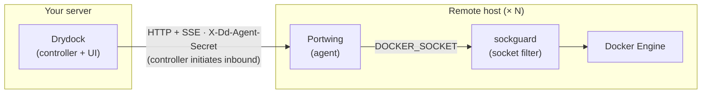
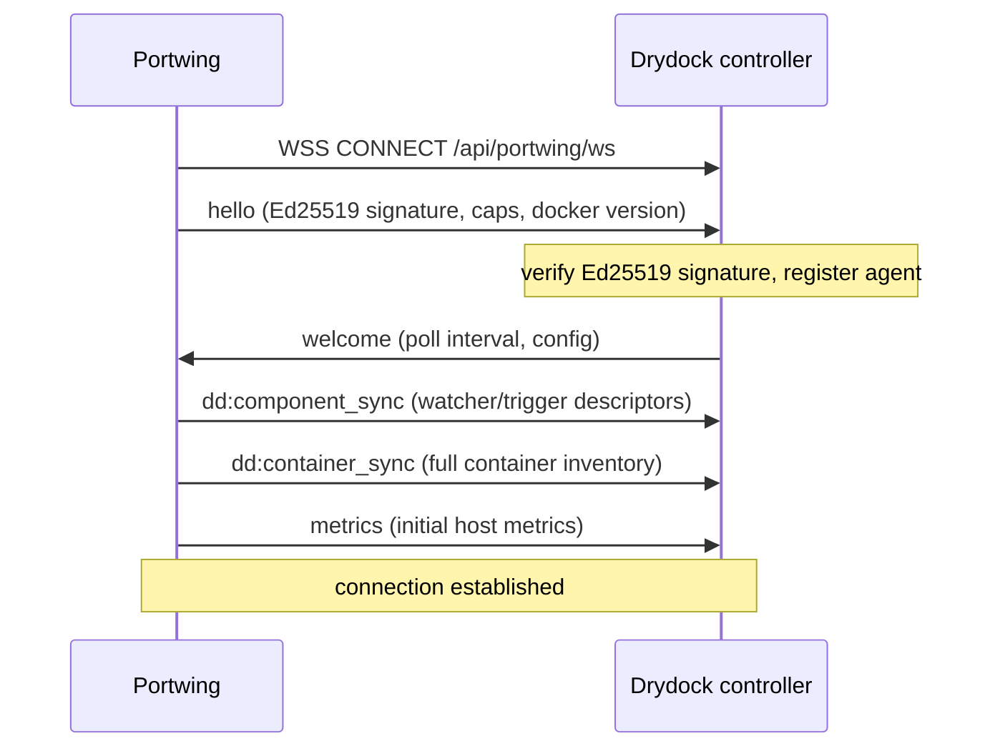
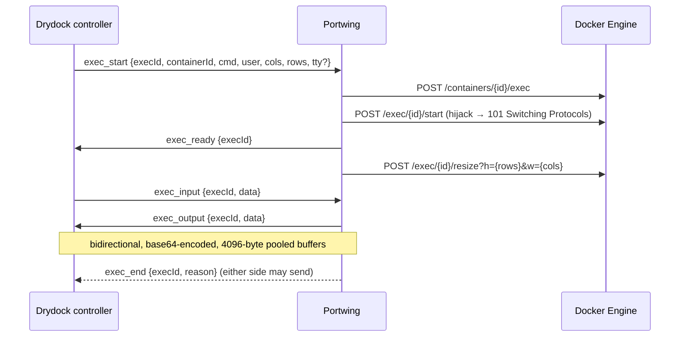

# Portwing -- Technical Specification

> Lightweight remote Docker agent for the Drydock container monitoring platform.

## 1. Overview

Portwing is a standalone Go binary that runs on remote Docker hosts, providing Drydock with secure access to the Docker Engine API, container inventory with update metadata, host metrics, interactive exec sessions, and Docker Compose operations. It communicates directly with the Drydock controller.



The Drydock controller opens an inbound HTTP connection to each remote host's
Portwing independently — handshake on `/api/containers`, then a long-lived SSE
stream on `/api/events`. sockguard is the recommended socket filter between
Portwing and the Docker Engine.

**Language:** Go 1.26+ (module), built with Go 1.26 (CI)
**Dependencies:** `gorilla/websocket`, `google/uuid` -- zero Docker SDK dependency (raw HTTP over Unix socket)

## 2. Connection Modes

### 2.1 Mode Detection

```text
DRYDOCK_URL set + (TOKEN or AUTHORIZED_KEYS or PRIVATE_KEY_FILE) set  ->  Edge Mode (outbound WebSocket)
Otherwise                                                              ->  Standard Mode (inbound HTTP server)
```

### 2.2 Standard Mode

Portwing runs an HTTP(S) server. The Drydock controller connects inbound.

- Transparent Docker API proxy (all paths forwarded to Docker socket)
- Dedicated agent endpoints under `/_portwing/*`
- Drydock-compatible REST + SSE endpoints under `/api/*` (Drydock compatibility)
- TLS 1.2+ with modern AEAD cipher suites

### 2.3 Edge Mode

Portwing initiates an outbound WebSocket connection to the Drydock controller's edge endpoint (`/api/portwing/ws`). All communication is multiplexed over this single connection. The endpoint is Ed25519-only and uses the stable `portwing/1.0` protocol. Drydock `v1.6.0-rc.11+` provides the complete Portwing v0.9.0 controller-owned watcher/update contract; older compatible controllers may still establish the wire connection without those additive feature semantics. Portwing itself remains pre-`v1.0.0`.

- Works behind NAT, firewalls, dynamic IPs
- Auto-reconnect with exponential backoff + jitter
- Private HTTP operations listener still serves health, readiness, metrics,
  and unauthenticated Edge audit export for local monitoring

## 3. WebSocket Protocol

**Protocol identifier:** `portwing/1.0`

### 3.1 Handshake



### 3.2 Hello Message

```json
{
  "type": "hello",
  "data": {
    "version": "0.9.0",
    "protocol": "portwing/1.0",
    "agentId": "uuid",
    "agentName": "my-server",
    "pubKeyId": "a3f2b1c9d8e7f6a4",
    "timestamp": 1749820800,
    "nonce": "0123456789abcdef0123456789abcdef",
    "signature": "<base64url-ed25519-signature>",
    "dockerVersion": "27.0.3",
    "hostname": "my-server",
    "capabilities": ["compose", "exec", "metrics", "events",
                      "edge-response-body-b64",
                      "dd:container-sync", "dd:logs"],
    "drydockCompat": "1.4.0",
    "watcherTypes": ["docker"],
    "triggerTypes": []
  }
}
```

The unsupported legacy `dd:watch` and `dd:trigger` capabilities are deliberately
absent. Discovery uses the Docker watcher descriptor (`execution: controller`)
and an empty trigger list; the corresponding wire message types remain reserved
for compatibility but are not advertised.

`edge-response-body-b64` is negotiated rather than just advertised: a
controller that supports it echoes the value in `welcome.capabilities`, and the
agent then carries every non-streaming Docker API response body as standard
base64 in the response message's `bodyBase64` field (legacy `body` left unset),
which lets non-JSON bodies such as the plain-text `OK` from `GET /_ping` cross
the wire. A welcome without the value keeps the legacy `body` encoding, so
older controllers interoperate without a protocol-version bump.

All JSON application messages are wrapped in an `Envelope` (`{"type": ..., "data": ...}`; see `internal/protocol/messages.go`) — the fields above live under `data`, not at the top level. (WebSocket ping/pong/close control frames are not wrapped.)

The Drydock `/api/portwing/ws` endpoint requires the Ed25519 fields (`pubKeyId`, `timestamp`, `nonce`, `signature`) and rejects token-hash hellos with `ed25519-required`. `tokenHash` (SHA-256 of the shared token) is only a fallback for non-edge endpoints.

### 3.3 Message Types

**Core:**

| Type | Direction | Purpose |
|------|-----------|---------|
| `hello` | Agent -> Server | Auth + capability exchange |
| `welcome` | Server -> Agent | Connection accepted; carries `capabilities` on controllers that negotiate them |
| `request` | Server -> Agent | Docker API request (with `requestId`), including controller-owned watcher/update calls |
| `response` | Agent -> Server | Docker API response (correlated by `requestId`) |
| `stream` | Bidirectional | Streaming data (logs, exec, build) |
| `stream_end` | Bidirectional | End of stream |
| `metrics` | Agent -> Server | Host metrics payload |
| `container_event` | Agent -> Server | Docker lifecycle event; used instead of a duplicate controller event stream |
| `ping` / `pong` | Either | Keepalive (30s default) |
| `error` | Either | Error with optional `code` |
| `exec_start` | Server -> Agent | Start interactive exec session |
| `exec_ready` | Agent -> Server | Exec session attached |
| `exec_input` | Server -> Agent | Terminal input (base64) |
| `exec_output` | Agent -> Server | Terminal output (base64) |
| `exec_resize` | Server -> Agent | Terminal resize (cols, rows) |
| `exec_end` | Bidirectional | End exec session |

**Drydock-specific (`dd:` namespace):**

| Type | Direction | Purpose |
|------|-----------|---------|
| `dd:container_sync` | Agent -> Server | Full container inventory with update metadata |
| `dd:container_added` | Agent -> Server | New container discovered |
| `dd:container_updated` | Agent -> Server | Container state/metadata changed |
| `dd:container_removed` | Agent -> Server | Container removed |
| `dd:component_sync` | Agent -> Server | Watcher + trigger component descriptors |
| `dd:watch_request` | Server -> Agent | Reserved legacy remote-watcher message; not advertised by the controller-owned contract |
| `dd:watch_response` | Agent -> Server | Reserved legacy remote-watcher response |
| `dd:watch_container_request` | Server -> Agent | Reserved legacy single-container watcher message |
| `dd:watch_container_response` | Agent -> Server | Reserved legacy single-container watcher response |
| `dd:trigger_request` | Server -> Agent | Reserved legacy remote-trigger message; Portwing advertises no trigger |
| `dd:trigger_response` | Agent -> Server | Reserved legacy remote-trigger response |
| `dd:container_log_request` | Server -> Agent | Request container logs (`tail`, `since`, `until`, `follow`, `timestamps`) |
| `dd:container_log_response` | Agent -> Server | Container log data (correlated by `requestId`) |
| `dd:container_delete_request` | Server -> Agent | Request container removal |
| `dd:container_delete_response` | Agent -> Server | Removal result (`success`/`error`, correlated by `requestId`) |

The `dd:container_log_*` and `dd:container_delete_*` pairs each carry an
optional `requestId` that the agent echoes back on the response, so a controller
can correlate concurrent requests for the same container instead of matching
responses positionally (a controller must read the echo to use it; one matching
positionally is unaffected). `dd:container_log_response.logs` is plain text —
Docker's 8-byte stream-frame headers are stripped for a non-TTY container and a
TTY container's header-less stream is passed through unchanged — matching the
HTTP `/logs` route. `follow` is served as a **bounded** live window (the agent
asks the daemon to end the stream a few seconds out, via a Unix-timestamp
`until`) because the response is a single buffered message, not a stream —
continuous tailing uses the `request`/`stream`/`stream_end` path against
`GET /containers/{id}/logs?follow=1`.

## 4. Standard Mode HTTP API

### 4.1 Agent Endpoints

| Endpoint | Method | Auth | Description |
|----------|--------|------|-------------|
| `/_portwing/health` | GET | No | `{"status":"healthy"}` + Docker connectivity |
| `/_portwing/info` | GET | Yes | Agent version, Docker version, mode, uptime, caps |
| `/_portwing/compose` | POST | Yes | Docker Compose operations |
| `/_portwing/metrics` | GET | Yes | Prometheus metrics (build/host/container + agent request series) |
| `/_portwing/audit` | GET | Yes | Recent audit records (JSON, newest-first) |
| `/_portwing/audit/export` | GET | Yes | Cursor-based audit records (NDJSON, oldest-first) |

Edge mode keeps a local operations listener on `BIND_ADDRESS:PORT` for
`/health`, `/ready`, `/_portwing/health`, `/metrics`, and
`/_portwing/audit/export`. This is not the controller transport: control traffic
still dials Drydock over the outbound WebSocket. The listener does not apply
inbound authentication in Edge mode, so it is a private-operations trust
boundary and must not be exposed to an untrusted host, cluster, or public
network. Audit records can include client addresses, request paths, stack names,
and container identifiers.

### 4.2 Docker API Proxy

`/*` (all other paths) -> Transparent proxy to Docker Engine API.

- Streaming detection for `/logs`, `/attach`, `/exec/*/start`, `/events`, `/build`, `/images/create`, `/images/push`
- Connection hijacking for interactive exec (`Upgrade: tcp`)
- Hop-by-hop header stripping
- Binary response auto-detection

### 4.3 Drydock-Compatible Endpoints

| Endpoint | Method | Auth | Description |
|----------|--------|------|-------------|
| `/api/events` | GET | Yes | SSE stream (`dd:ack`, `dd:container-added/updated/removed`) |
| `/api/containers` | GET | Yes | Full container inventory JSON |
| `/api/containers/:id/logs` | GET | Yes | Container logs (demuxed) |
| `/api/containers/:id` | DELETE | Yes | Remove container |
| `/api/watchers` | GET | Yes | Watcher component descriptors |
| `/api/watchers/:type/:name` | GET | Yes | Single watcher descriptor (404 if unknown) |
| `/api/triggers` | GET | Yes | Trigger component descriptors |
| `/api/watchers/:type/:name` | POST | Yes | Legacy watcher route (501; controller owns execution) |
| `/api/watchers/:type/:name/container/:id` | POST | Yes | Legacy single-container route (501) |
| `/api/triggers/:type/:name` | POST | Yes | Legacy trigger route (501; no trigger advertised) |
| `/api/triggers/:type/:name/batch` | POST | Yes | Legacy batch-trigger route (501) |
| `/api/log/entries` | GET | Yes | Log entries — returns `[]` (Drydock `AgentClient.getLogEntries()` compatibility) |
| `/health` | GET | No | Simple health check |

### 4.4 Authentication

- **Header:** `Authorization: Bearer` (primary), `X-Portwing-Token`, `X-Dd-Agent-Secret` (Drydock compatibility)
- **Comparison:** `crypto/subtle.ConstantTimeCompare` (timing-safe)
- **Rate limiting:** 10 failed attempts per IP per minute, 10K IP cap, background cleanup every 5min
- Token is optional in Standard mode (if not configured, no auth required)

## 5. Docker Client Architecture

```go
type DockerClient struct {
    socketPath   string
    apiVersion   string          // Negotiated via GET /version (e.g., "v1.47")
    httpClient   *http.Client    // 30s timeout, 100 max idle conns
    streamClient *http.Client    // No timeout, for logs/exec/events
}
```

- **Transport:** `net.Dial("unix", socketPath)` -- raw HTTP over Unix domain socket
- **No Docker SDK** -- direct HTTP requests (~zero dependencies)
- **API version negotiation:** Query `/version` on startup, extract `ApiVersion`, prefix paths. Fallback: `v1.44`
- **Socket auto-detection order:** `/var/run/docker.sock`, `$HOME/.docker/run/docker.sock`, `$HOME/.orbstack/run/docker.sock`, `/run/docker.sock`

## 6. Docker Compose Operations

**Auto-detects** `docker compose` (v2) vs `docker-compose` (v1).

### 6.1 Supported Operations

| Operation | Flags |
|-----------|-------|
| `up` | `-d --remove-orphans`, optional `--build`, `--force-recreate`, `--no-deps {service}` |
| `down` | `--remove-orphans`, optional `--volumes` |
| `pull` | -- |
| `ps` | `--format json` |
| `logs` | `--tail N` |
| `restart` / `stop` / `start` | -- |

### 6.2 Security

- **Path traversal protection:** All file paths resolved to absolute, verified within stack directory
- **Env var validation:** Keys must match `^[a-zA-Z_][a-zA-Z0-9_]*$`
- **Env var denylist:** `LD_PRELOAD`, `LD_LIBRARY_PATH`, `PATH`, `DOCKER_HOST`, `DOCKER_CONFIG`, `DOCKER_CERT_PATH`, `DOCKER_TLS_VERIFY`, `DOCKER_CONTEXT`, `HOME`, `SHELL`, `BASH_ENV`, `ENV`, `CDPATH`, `IFS`
- **Service name validation:** Reject values starting with `-` (flag injection prevention)
- **Registry auth:** `docker login --password-stdin` before `up`/`pull`
- **API version forwarding:** Sets `DOCKER_API_VERSION` + `DOCKER_HOST` in subprocess env

## 7. Exec / Terminal Sessions

### 7.1 Edge Mode (WebSocket)



`tty` in `exec_start` is optional and defaults to `true`: omit it (or send `true`) to allocate a PTY, `false` to run the exec without one.

### 7.2 Standard Mode (HTTP Hijack)

- Detect `/exec/*/start` requests
- If client sends `Upgrade: websocket` or `Upgrade: tcp` -> hijack connection, bidirectional `io.Copy`
- Non-interactive exec -> return output as normal HTTP response

### 7.3 Limits

- Max 100 concurrent exec sessions (edge mode: fixed; standard mode: `MAX_EXEC_SESSIONS`, default 100, non-positive disables the bound)
- Max 100 concurrent stream sessions (edge mode: fixed; standard mode: `MAX_STREAM_SESSIONS`, default 100, non-positive disables the bound). Covers the streaming Docker proxy responses and the adapter routes that bypass the proxy handler (`/api/events` SSE and follow-mode container logs), which share the same bound. A rejected adapter stream answers `503` with the same body as a rejected proxy stream. Non-follow log reads are a single bounded response and are never gated.
- Exec body size limit: 10 MB
- Retry loop for write/resize (up to 10 attempts, 50ms intervals)

## 8. Metrics Collection

**Interval:** 30 seconds

In addition to host/container metrics, the Prometheus endpoints (`/_portwing/metrics`, `/metrics`) expose agent-level series: `portwing_http_requests_total{method,code}` (counter), `portwing_http_request_duration_seconds` (histogram), `portwing_http_requests_in_flight` (gauge), `portwing_auth_failures_total{reason}` (counter), `portwing_rate_limited_total` (counter).

```json
{
  "cpuUsage": 23.5,
  "cpuCores": 4,
  "memoryTotal": 8589934592,
  "memoryUsed": 4294967296,
  "memoryFree": 4294967296,
  "diskTotal": 107374182400,
  "diskUsed": 53687091200,
  "diskFree": 53687091200,
  "diskMetricsAvailable": true,
  "networkRxBytes": 1048576,
  "networkTxBytes": 524288,
  "uptime": 86400
}
```

`diskMetricsAvailable` is `false` when the `statfs` read on the Docker data root fails or reports an unusable block size, and also when `SKIP_DF_COLLECTION` is set, in which case `diskError` is empty because no read was attempted. On a failed read the disk fields above stay zero and `diskError` carries the path and the failing error; a successful read populates them and leaves `diskError` empty.

Its relationship to `ErrHostMetricsUnsupported`/`portwing_host_metrics_supported` (which cover the `/proc`-derived fields) is one-directional, not independent: a broken data root leaves the `/proc` fields intact, but a missing `/proc` short-circuits collection before `statfs` runs, so no disk figure is reported on a host without procfs even though `statfs` would have worked there.

| Metric | Source | Platform |
|--------|--------|----------|
| CPU usage | `/proc/stat` (delta-based) | Linux |
| CPU cores | `runtime.NumCPU()` | Cross-platform |
| Memory | `/proc/meminfo` | Linux |
| Disk | `syscall.Statfs(dockerDataRoot)` | Cross-platform |
| Network | `/proc/net/dev` (all non-lo interfaces) | Linux |
| Uptime | `/proc/uptime` | Linux |

`dockerDataRoot` is resolved from the Docker daemon's `/info` (`DockerRootDir`) on first collection, bounded by a 2s timeout and retried at most once per 30s on failure; it falls back to `/var/lib/docker` until a lookup succeeds. `SKIP_DF_COLLECTION` env var disables disk metrics entirely, skipping both the lookup and the `statfs` call.

## 9. Container Event Streaming

Subscribes to Docker `/events?type=container` API.

### 9.1 Action Whitelist

`create`, `start`, `stop`, `die`, `kill`, `restart`, `pause`, `unpause`, `destroy`, `rename`, `update`, `oom`, `health_status`

### 9.2 Mapping to Drydock Events

| Docker Action | Drydock Effect |
|---------------|----------------|
| `start` (new container) | `dd:container_added` |
| `start` (known container) | Status update in inventory |
| `die` / `stop` | Status update in inventory |
| `destroy` | `dd:container_removed` |

### 9.3 Reconnection

Dedicated non-pooled Unix socket. Exponential backoff (5s initial, 60s max), resets after 30s of stable connection.

## 10. Drydock Container Model

### 10.1 Container Structure

```go
type Container struct {
    ID              string            `json:"id"`
    Name            string            `json:"name"`
    DisplayName     string            `json:"displayName"`
    DisplayIcon     string            `json:"displayIcon,omitempty"`
    Status          string            `json:"status"`
    Watcher         string            `json:"watcher"`
    Agent           string            `json:"agent,omitempty"`
    Image           ContainerImage    `json:"image"`
    Result          *ContainerResult  `json:"result,omitempty"`
    Error           *ContainerError   `json:"error,omitempty"`
    UpdateAvailable bool              `json:"updateAvailable"`
    UpdateKind      ContainerUpdateKind `json:"updateKind"`
    IncludeTags     string            `json:"includeTags,omitempty"`
    ExcludeTags     string            `json:"excludeTags,omitempty"`
    TransformTags   string            `json:"transformTags,omitempty"`
    Labels          map[string]string `json:"labels,omitempty"`
    Details         *RuntimeDetails   `json:"details,omitempty"`
}
```

`Details` (the `details` field) carries per-container runtime information populated from Docker inspect data:

```go
type RuntimeDetails struct {
    Platform string        `json:"platform,omitempty"`
    Command  string        `json:"command,omitempty"`
    Ports    []PortMapping `json:"ports,omitempty"`
    Network  []NetworkInfo `json:"network,omitempty"`
    Volumes  []VolumeInfo  `json:"volumes,omitempty"`
    Env      []EnvVar      `json:"env,omitempty"`
    Created  string        `json:"created,omitempty"`
    Started  string        `json:"started,omitempty"`
    Health   string        `json:"health,omitempty"`
}

type EnvVar struct {
    Key   string `json:"key"`
    Value string `json:"value"`
}

type PortMapping struct {
    Container uint16 `json:"container"`
    Host      uint16 `json:"host,omitempty"`
    Protocol  string `json:"protocol"`
    IP        string `json:"ip,omitempty"`
}

type NetworkInfo struct {
    Name      string `json:"name"`
    IPAddress string `json:"ipAddress,omitempty"`
    Gateway   string `json:"gateway,omitempty"`
}

type VolumeInfo struct {
    Type        string `json:"type"`
    Source      string `json:"source"`
    Destination string `json:"destination"`
    ReadOnly    bool   `json:"readOnly"`
}
```

`env` is parsed from Docker's `Config.Env` (matching Drydock's `ContainerRuntimeEnv` shape); redacting sensitive values is the Drydock controller's responsibility.

### 10.2 Label Parsing

| Label | Purpose |
|-------|---------|
| `dd.watch` | `true` to monitor this container |
| `dd.tag.include` | Regex for tag inclusion |
| `dd.tag.exclude` | Regex for tag exclusion |
| `dd.tag.transform` | Tag transformation rule |
| `dd.display.name` | Custom display name |
| `dd.display.icon` | Custom icon |
| `dd.group` | Container grouping |
| `dd.link.template` | Custom link template |

### 10.3 Controller-Owned Watcher and Update Model

Portwing v0.9.0's `docker` watcher descriptor declares
`transport=docker-api`, `execution=controller`, and `events=portwing`.

1. Drydock `v1.6.0-rc.11+` runs its native watcher and update trigger through
   Portwing's authenticated Docker proxy: HTTP in Standard Mode and correlated
   `request`/`response` messages in Edge Mode.
2. Portwing reads `dd.*` labels, reports raw inventory, and emits Docker
   lifecycle events; `events=portwing` avoids a duplicate controller event
   stream.
3. Edge Mode sends `dd:component_sync` before `dd:container_sync`, so Drydock
   establishes ownership before it ingests raw container state.
4. Portwing advertises no remote trigger. Trigger component lists stay empty
   and legacy watcher/trigger POST routes return 501.
5. Drydock enriches the raw `updateAvailable=false` / `updateKind=unknown`
   inventory after its controller-owned registry check and owns update state.

These fields are additive, so `DrydockCompat` remains `1.4.0`; older controllers
can be wire-compatible without providing the full v0.9.0 feature contract.

### 10.4 SSE Backward Compatibility

Standard mode `/api/events` SSE stream produces:

```text
data: {"type":"dd:ack","data":{"version":"0.9.0","os":"linux","arch":"amd64",...}}

data: {"type":"dd:container-added","data":{...Container...}}
data: {"type":"dd:container-updated","data":{...Container...}}
data: {"type":"dd:container-removed","data":{"id":"abc123"}}
```

## 11. Security Model

### 11.1 Authentication

| Layer | Mechanism |
|-------|-----------|
| Standard mode | `X-Portwing-Token` or `X-Dd-Agent-Secret` header, timing-safe |
| Edge mode | Ed25519 signed hello (`pubKeyId`/`timestamp`/`nonce`/`signature`) when `PRIVATE_KEY_FILE` is set; the Drydock `/api/portwing/ws` endpoint requires it and rejects token-hash hellos |
| Rate limiting | 10 failures/min/IP, 10K IP cap, 5min cleanup |
| Token source | `TOKEN` env var or `TOKEN_FILE` |

### 11.2 TLS

| Setting | Value |
|---------|-------|
| Minimum version | TLS 1.2 |
| Cipher suites (1.2) | ECDHE+AES-256-GCM, ECDHE+AES-128-GCM, ECDHE+ChaCha20-Poly1305 |
| Curves | X25519, P-256 |

### 11.3 Resource Limits

| Resource | Limit |
|----------|-------|
| WebSocket read | 16 MB |
| Response body read | 100 MB |
| Exec request body | 10 MB |
| Enrollment request body | 64 KiB / 10 seconds |
| Concurrent enrollment handlers | 32 agent-wide / 2 per client |
| Concurrent exec sessions | 100 (edge: fixed; standard: `MAX_EXEC_SESSIONS`, non-positive disables) |
| Concurrent stream sessions | 100 (edge: fixed; standard: `MAX_STREAM_SESSIONS`, non-positive disables). Excludes adapter `/api/events` and follow-mode logs. |

## 12. Configuration

See [README.md](README.md) for the full configuration reference.

## 13. Reconnection and Keepalive

### 13.1 Edge Mode Reconnection

```text
Attempt 1: connect -> fail -> wait 1s (+/-25% jitter)
Attempt 2: connect -> fail -> wait 2s (+/-25% jitter)
...
Attempt N: connect -> fail -> wait min(2^N, 60s) (+/-25% jitter)
On success: reset backoff to 1s
```

A hello rejection (`error` frame in place of `welcome`) is classified before
reconnecting. **Terminal** codes — where retrying the same configuration cannot
succeed (`ed25519-required`, `unknown-key`, `bad-signature`, `protocol-mismatch`,
`no-auth`, `invalid-agent-name`, `parse-error`, `expected-hello`,
`agent-name-claimed`) — stop the agent with an actionable error instead of
looping forever. Everything else (timing/capacity conditions like
`timestamp-skew`, `replay`, `rate-limited`, `registry-full`,
`agent-already-connected`, and any unrecognized code) is retried with backoff.
This code set mirrors the drydock controller and is not itself a versioned wire
contract, so an unrecognized code defaults to retry rather than a hard stop.

### 13.2 Keepalive

- Agent sends `ping` every `HEARTBEAT_INTERVAL` seconds
- Read deadline: `max(2 * HEARTBEAT_INTERVAL, 60s)`
- Missing pong triggers reconnection

### 13.3 Graceful Shutdown

- Listens for `SIGINT` and `SIGTERM`
- Closes all exec sessions
- Sends WebSocket close frame (code 1000, reason "shutdown")
- HTTP server: `Shutdown()` with 10s timeout

## 14. Build and Release

### 14.1 Targets

- **Binaries:** `CGO_ENABLED=0`, `-trimpath`, `-s -w` (stripped)
- **OS/Arch:** linux/amd64, linux/arm64, linux/arm/v7, darwin/amd64, darwin/arm64
- **Docker:** Multi-arch manifest at `ghcr.io/codeswhat/portwing`
- **Base images:** Wolfi OS (amd64/arm64), Alpine (armv7)

### 14.2 Docker Image

Chainguard Wolfi OS packages assembled into a `FROM scratch` image (Alpine on armv7). Minimal OCI image with no package manager in the runtime — packages are installed into a staging rootfs and copied into the final scratch stage, retaining the package database for scanners.

Packages:

- **Wolfi (amd64/arm64):** `ca-certificates-bundle`, `busybox`, `docker-cli`, `docker-compose`, `wget`
- **Alpine (armv7):** `ca-certificates`, `busybox`, `docker-cli`, `docker-cli-compose`, `wget`

## 15. Migration Strategy

1. **Phase 1: Drop-in Standard Mode** -- Replace existing Node.js agent with Portwing binary
2. **Phase 2: Edge Mode** -- Complete; the stable `portwing/1.0` endpoint is production supported, and Drydock `v1.6.0-rc.11+` implements the full v0.9.0 controller-owned watcher/update contract
3. **Phase 3: Native WebSocket in Drydock** -- Replace AgentClient SSE with WebSocket
4. **Phase 4: Deprecate SSE** -- Remove SSE endpoints after one release cycle
