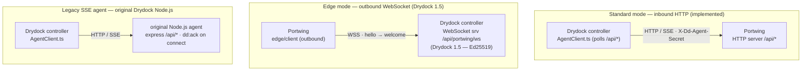
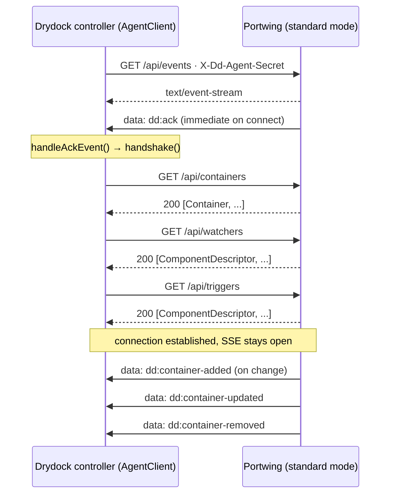
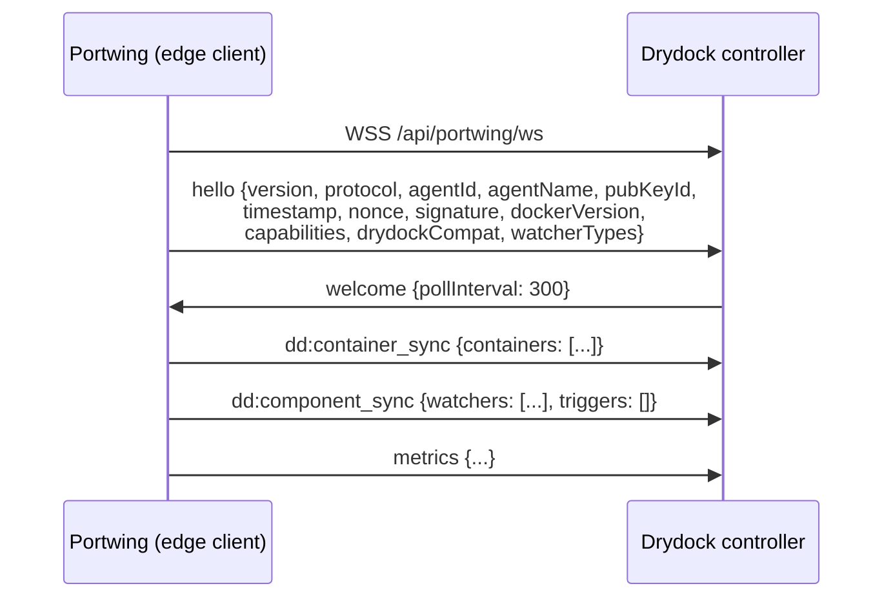

# Drydock Integration Reference

> Verified against Drydock 1.5.x (`app/agent/AgentClient.ts`, `app/agent/api/`).

## Architecture

Drydock supports two agent connectivity patterns. Portwing implements both.



Portwing Standard Mode replaces the Legacy SSE Agent. Edge Mode has Portwing dial outbound to the Drydock controller's `/api/portwing/ws` endpoint using the `portwing/1.0` protocol; the controller endpoint shipped in Drydock 1.5 and requires an Ed25519-signed hello.

---

## Standard Mode: Drydock 1.5.x Handshake Sequence

Source: `app/agent/AgentClient.ts:506–579`



Source citation:
- `AgentClient.ts:506` — `handshake()` deduplication guard
- `AgentClient.ts:519` — `GET /api/containers`
- `AgentClient.ts:547` — `GET /api/watchers`
- `AgentClient.ts:559` — `GET /api/triggers`
- `AgentClient.ts:717` — `startSse()` → `GET /api/events`
- `AgentClient.ts:654` — `parseSseLine()` parses `data: {...}\n\n`

---

## Edge Mode: Portwing WebSocket Handshake

Source: `internal/edge/client.go`, `internal/protocol/messages.go`



The edge-mode hello is Ed25519-signed (`pubKeyId`/`timestamp`/`nonce`/`signature`); the controller endpoint is Ed25519-only and rejects token-hash hellos. The full `hello` payload (exact field set) is in [SPEC.md §3.2](../SPEC.md#32-hello-message).

> **Drydock version:** the `/api/portwing/ws` controller endpoint and the `portwing/1.0` protocol string require a Drydock build that ships them. Drydock 1.5 is the first controller release with this endpoint, so edge mode needs Drydock 1.5+; older controllers do not expose it.

---

## Endpoints Portwing Serves (Standard Mode)

All `/api/*` endpoints require `X-Dd-Agent-Secret` or `X-Portwing-Token` header.

| Drydock Call | Portwing Endpoint | Method | Notes |
|---|---|---|---|
| `AgentClient.startSse()` L717 | `GET /api/events` | GET | SSE stream; `dd:ack` on connect |
| `AgentClient._doHandshake()` L519 | `GET /api/containers` | GET | `[]Container` JSON |
| `AgentClient._doHandshake()` L547 | `GET /api/watchers` | GET | `[]ComponentDescriptor` |
| `AgentClient._doHandshake()` L559 | `GET /api/triggers` | GET | `[]ComponentDescriptor` (empty) |
| `AgentClient.getWatcher()` L1552 | `GET /api/watchers/{type}/{name}` | GET | Single watcher descriptor |
| `AgentClient.getContainerLogs()` L1523 | `GET /api/containers/{id}/logs` | GET | Plain text or `{logs:"..."}` |
| `AgentClient.deleteContainer()` L1539 | `DELETE /api/containers/{id}` | DELETE | 204 on success |
| `AgentClient.watch()` L1567 | `POST /api/watchers/{type}/{name}` | POST | 501 (controller does registry checks) |
| `AgentClient.watchContainer()` L1586 | `POST /api/watchers/{type}/{name}/container/{id}` | POST | 501 |
| `AgentClient.runRemoteTrigger()` L1421 | `POST /api/triggers/{type}/{name}` | POST | 501 (no agent-side triggers in v1) |
| `AgentClient.runRemoteTriggerBatch()` L1469 | `POST /api/triggers/{type}/{name}/batch` | POST | 501 |
| `AgentClient.getLogEntries()` L1503 | `GET /api/log/entries` | GET | `[]` (no in-memory buffer) |
| Drydock probes | `GET /health` | GET | `{"status":"ok"}` (no auth) |

---

## SSE Event Shapes

Drydock parses SSE frames as `data: <json>\n\n`. Each frame is a JSON object
with `type` and `data` fields (`AgentClient.ts:659`).

### `dd:ack` (sent on every new SSE connection)

Drydock reads: `version`, `os`, `arch`, `cpus`, `memoryGb`, `uptimeSeconds`, `lastSeen`
(`AgentClient.ts:744–763`)

Portwing sends:
```json
{
  "type": "dd:ack",
  "data": {
    "version": "0.1.0",
    "os": "linux",
    "arch": "amd64",
    "cpus": 4,
    "memoryGb": 0,
    "uptimeSeconds": 123,
    "lastSeen": "2026-06-11T12:00:00Z",
    "containers": {"total": 3, "running": 2, "stopped": 1},
    "images": 2
  }
}
```

Note: `memoryGb` is 0 on Portwing 0.2.0 and earlier (cgo/sysinfo omitted); Drydock accepts 0. A later release reports real memory on Linux via `/proc/meminfo` (still no cgo).

### `dd:container-added` / `dd:container-updated`

```json
{"type": "dd:container-added", "data": {<Container object>}}
```

### `dd:container-removed`

Drydock reads only `.data.id` (`AgentClient.ts:782`). Portwing also sends `name`
(harmless extra field).

```json
{"type": "dd:container-removed", "data": {"id": "abc123", "name": "web"}}
```

---

## Container Object Shape

Drydock's `AgentClient._doHandshake()` passes containers from `GET /api/containers`
directly to `storeContainer.insertContainer()` / `storeContainer.updateContainer()`.
Drydock expects these fields:

| Field | Type | Notes |
|---|---|---|
| `id` | string | Docker container ID |
| `name` | string | Container name (no leading `/`) |
| `displayName` | string | From `dd.display.name` label or falls back to `name` |
| `displayIcon` | string? | From `dd.display.icon` label |
| `status` | string | `running`, `stopped`, `paused`, `restarting`, `dead`, `created` |
| `watcher` | string | Watcher name (Portwing: `"docker"` or from `dd.watch` label) |
| `agent` | string? | Agent name (set by Drydock controller, stripped in agent responses) |
| `image.id` | string | Image SHA |
| `image.registry` | string | e.g. `"docker.io"` |
| `image.name` | string | Image name |
| `image.tag` | string | Image tag |
| `updateAvailable` | bool | Always `false` (Drydock controller performs registry checks) |
| `updateKind` | string | Always `"unknown"` |
| `labels` | object? | All Docker labels |
| `details` | object? | Runtime details (ports, networks, volumes, health) |

---

## Watcher Component Descriptor Shape

`GET /api/watchers` returns an array. `GET /api/watchers/{type}/{name}` returns one.

Drydock reads: `type`, `name`, `configuration`, `metadata` (`AgentClient.ts:489–503`).

Portwing returns:
```json
[{
  "type": "docker",
  "name": "docker",
  "configuration": {
    "description": "Watches Docker containers for updates via Docker Engine API",
    "capabilities": ["container-sync", "labels"]
  }
}]
```

`id` and `agent` fields (present in Drydock's own `mapComponentToItem`) are not
required by the AgentClient — it never reads them from the remote agent response.

---

## Environment Variable Mapping

### Drydock Controller Side (configures the connection to Portwing)

| Drydock env var / config | Description |
|---|---|
| Agent `host` | Portwing hostname/IP (set in Drydock agent component config, no env var) |
| Agent `port` | Portwing port (default 3000) |
| Agent `secret` | Shared secret → sent as `X-Dd-Agent-Secret` |
| `DD_AGENT_ALLOW_INSECURE_SECRET=true` | Allow secret over plain HTTP |
| Agent `cafile` | CA cert for TLS verification |
| Agent `certfile` / `keyfile` | mTLS certificate pair |

Source: `app/agent/components/Agent.ts:4–11`, `AgentClient.ts:247–258`

### Portwing Side (agent binary)

| Portwing env var | Purpose | Drydock counterpart |
|---|---|---|
| `TOKEN` | Shared secret (preferred) | Drydock agent `secret` |
| `DD_AGENT_SECRET` | Shared secret (Drydock agent secret) | Drydock agent `secret` |
| `TOKEN_FILE` | Path to file containing token | Drydock `DD_AGENT_SECRET_FILE` |
| `DD_AGENT_SECRET_FILE` | Path to file containing token | Drydock `DD_AGENT_SECRET_FILE` |
| `TOKEN_HASH` | Argon2id PHC hash of token (standard mode only) | n/a |
| `PORT` | HTTP listen port (default `3000`) | Drydock agent `port` |
| `BIND_ADDRESS` | Bind address (default `0.0.0.0`) | n/a |
| `TLS_CERT` / `TLS_KEY` | TLS certificate/key | Drydock agent `certfile`/`keyfile` |
| `CA_CERT` | CA cert for edge mode TLS | Drydock agent `cafile` |
| `TLS_SKIP_VERIFY` | Skip TLS verification in edge mode | n/a |
| `DRYDOCK_URL` | Edge mode controller URL (agent dials out to `/api/portwing/ws`) | n/a |
| `AGENT_ID` | UUID for this agent | Drydock registers via `hello.agentId` |
| `AGENT_NAME` | Display name (default: hostname) | Drydock agent component `name` |
| `DD_POLL_INTERVAL` | Container refresh interval in s (default 300) | n/a |
| `DOCKER_SOCKET` | Docker socket path | n/a |
| `LOG_LEVEL` | `debug`/`info`/`warn`/`error` | n/a |
| `TRUSTED_PROXIES` | CIDR list for X-Forwarded-For | n/a |

---

## Compatibility Matrix

| Feature | Status | Evidence |
|---|---|---|
| `GET /api/events` SSE stream | COMPATIBLE | Portwing: `sse.go:48`; Drydock: `AgentClient.ts:717` |
| `dd:ack` event on connect | COMPATIBLE | Portwing: `sse.go:74`; Drydock: `AgentClient.ts:1299` |
| `dd:ack` fields (version, os, arch, cpus, memoryGb, uptimeSeconds, lastSeen) | COMPATIBLE | Drydock `AgentClient.ts:744–763` reads exactly these fields |
| `dd:ack memoryGb=0` | COMPATIBLE | Drydock treats 0 as valid (no assertion on non-zero) |
| `dd:container-added` SSE | COMPATIBLE | Portwing: `sse.go:174`; Drydock: `AgentClient.ts:1303` |
| `dd:container-updated` SSE | COMPATIBLE | Portwing: `sse.go:187`; Drydock: `AgentClient.ts:1303` |
| `dd:container-removed` SSE (`{id, name}`) | COMPATIBLE | Drydock only reads `.id` (`AgentClient.ts:782`); extra `name` is harmless |
| `GET /api/containers` returns `[]Container` | COMPATIBLE | Portwing: `routes.go:27`; Drydock: `AgentClient.ts:519` |
| Container shape (id, name, displayName, status, watcher, image, labels, details) | COMPATIBLE | Portwing `model.go`; Drydock `model/container.js` |
| `GET /api/watchers` returns `[]ComponentDescriptor` | COMPATIBLE | Portwing: `routes.go:103`; Drydock: `AgentClient.ts:547` |
| `GET /api/watchers/{type}/{name}` (single watcher) | COMPATIBLE | Fixed in this PR: `routes.go:handleWatcherGet` |
| `GET /api/triggers` returns `[]` | COMPATIBLE | Portwing: `routes.go:108`; Drydock: `AgentClient.ts:559` |
| `GET /api/containers/{id}/logs` plain text | COMPATIBLE | Drydock `logs.ts:134–145` accepts both plain text and `{logs:"..."}` |
| `DELETE /api/containers/{id}` returns 204 | COMPATIBLE | Portwing: `routes.go:92`; Drydock: `AgentClient.ts:1543` |
| `POST /api/watchers/{type}/{name}` | COMPATIBLE (501) | Drydock runs registry checks itself, not via this endpoint in v1 |
| `POST /api/watchers/{type}/{name}/container/{id}` | COMPATIBLE (501) | Same as above |
| `POST /api/triggers/{type}/{name}` | COMPATIBLE (501) | No agent-side triggers in Portwing v1 |
| `POST /api/triggers/{type}/{name}/batch` | COMPATIBLE (501) | Same |
| `GET /api/log/entries` returns `[]` | COMPATIBLE | Fixed in this PR: `routes.go:handleLogEntries`; Drydock `AgentClient.ts:1503` |
| Authentication via `X-Dd-Agent-Secret` | COMPATIBLE | Portwing: `server/http.go` auth middleware; Drydock: `api/index.ts:73` |
| `/health` unauthenticated | COMPATIBLE | Portwing: `routes.go:handleSimpleHealth`; Drydock: `api/index.ts:152` |
| `dd:watcher-snapshot` SSE event | COMPATIBLE | Emitted after every poll cycle and on SSE connect (after `dd:ack`); see below |
| `dd:update-applied` / `dd:update-failed` SSE | N-A | Drydock emits these; Portwing does not participate in update operations |
| `dd:update-operation-changed` SSE | N-A | Same |
| `dd:batch-update-completed` SSE | N-A | Same |
| `dd:security-alert` / `dd:security-scan-cycle-complete` SSE | N-A | Portwing does not perform security scanning |
| Edge Mode WebSocket (`/api/portwing/ws`) | IMPLEMENTED (Drydock 1.5) | Portwing: `edge/client.go` + Ed25519 hello; Drydock: `app/api/portwing-ws.ts` (Ed25519-only). Requires Drydock 1.5 + Portwing 0.2.2 (pre-release) |

---

## Gaps Requiring Drydock-side Changes

None. GAP-1 below was originally identified as requiring a Drydock-side
tolerance change; it has since been resolved Portwing-side.

### GAP-1 (RESOLVED): `dd:watcher-snapshot` SSE event not emitted by Portwing

**Resolution:** Portwing now emits `dd:watcher-snapshot` from `SSEBroadcaster`
after every container poll cycle (`Adapter.OnContainerRefresh`) and sends the
current snapshot to each newly connected SSE client immediately after
`dd:ack`. No Drydock-side change is needed.

**What Drydock expects:** When a watcher completes a full poll cycle, the original
Drydock Node.js agent emits a `dd:watcher-snapshot` SSE event:

```json
{
  "type": "dd:watcher-snapshot",
  "data": {
    "watcher": {"type": "docker", "name": "docker", "configuration": {...}},
    "containers": [<Container>, ...]
  }
}
```

Drydock's `AgentClient.ts:1310` handles this event to prune stale containers
(containers present in the previous inventory but absent from the snapshot are
removed). Additionally, `app/agent/api/event.ts:334` replays the last snapshot
per watcher to newly connected SSE clients, so a reconnecting controller never
misses the authoritative container list.

**What Portwing does instead:** Portwing emits individual `dd:container-added`,
`dd:container-updated`, and `dd:container-removed` events. The controller
receives these incremental events and maintains its own store. Pruning after
reconnects depends on the handshake `GET /api/containers` call (which Drydock
already does).

**Impact:** Low for most deployments. If a container is removed while the SSE
connection is dropped and the controller reconnects, the handshake call to
`GET /api/containers` will prune it (`AgentClient.ts:535`). The only edge case
is a zero-container handshake (preserved as ambiguous by Drydock, `AgentClient.ts:537`)
which relies on `dd:watcher-snapshot` to later prune stale entries.

**How it was fixed:** `SSEBroadcaster.BroadcastWatcherSnapshot` marshals the
watcher descriptor plus the full cached inventory (`ContainerManager.GetContainers`,
already rebuilt by the poll cycle that triggered the broadcast) — no extra
cycle tracking was needed. The snapshot is also written to each new SSE client
right after the `dd:ack` event so a reconnecting controller gets the
authoritative list without waiting up to one poll interval.

---

## Pre-built Docker Compose for Standard Mode

```yaml
services:
  portwing:
    image: ghcr.io/codeswhat/portwing:latest
    environment:
      TOKEN: "${DD_AGENT_SECRET}"       # same secret Drydock agent config uses
      PORT: "3000"
      AGENT_NAME: "my-server"
    volumes:
      - /var/run/docker.sock:/var/run/docker.sock:ro
    ports:
      - "3000:3000"
    restart: unless-stopped
```

In Drydock agent component configuration:
```yaml
agent:
  my-server:
    host: http://my-server-ip
    port: 3000
    secret: "${DD_AGENT_SECRET}"
```
