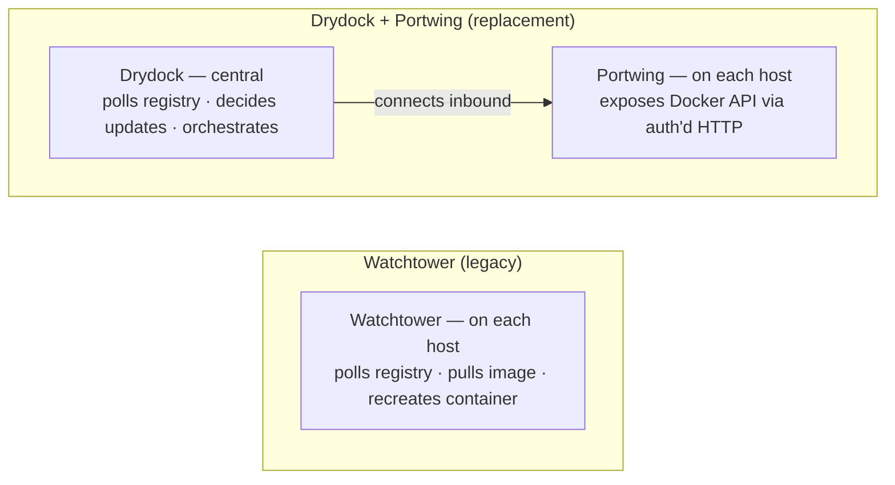

# Migrating from Watchtower

## Watchtower Status

Watchtower (containrrr/watchtower) was archived on **17 December 2025**. The
GitHub repository is now read-only. No future releases, bug fixes, or security
updates are planned. The final release is v1.7.1 (November 2023).

Source: Bobby Borisov, "Docker Update Tool Watchtower Reaches End of
Maintenance," *Linuxiac*, 23 December 2025.
<https://linuxiac.com/docker-update-tool-watchtower-reaches-end-of-maintenance/>

Running an archived, unpatched tool with access to the Docker socket is a
security liability. This guide shows how to replace Watchtower with the
equivalent capability in the Drydock ecosystem:

- **Drydock** — the container monitoring and update platform (replaces
  Watchtower's registry-poll and update logic).
- **Portwing** — the remote Docker agent that gives Drydock access to your
  host's Docker daemon.

---

## Architecture Comparison



Key differences:

| Aspect | Watchtower | Drydock + Portwing |
|--------|------------|-------------------|
| Update decision | On each host | Centralised in Drydock |
| Registry polling | Each host independently | Drydock controller |
| Visibility | None (just logs) | Full dashboard |
| Multi-host | Run one instance per host | Single Drydock, many Portwing agents |
| Authentication | None (Docker socket direct) | Token-based, TLS, rate-limited |
| Compose support | Limited | Full lifecycle via `/_portwing/compose` |
| Container filtering | Label `com.centurylinklabs.watchtower.enable` | Label `dd.watch=true` |

---

## Standard Mode (inbound HTTP)

Use this when the Drydock controller can reach your host directly (no NAT).

```yaml
# docker-compose.yml
services:
  portwing:
    image: ghcr.io/codeswhat/portwing:latest
    restart: unless-stopped
    volumes:
      - /var/run/docker.sock:/var/run/docker.sock
      - /data/stacks:/data/stacks        # Compose stack files
    ports:
      - "3000:3000"
    environment:
      TOKEN: "${PORTWING_TOKEN}"           # Set a strong secret
      PORT: "3000"                        # Default; change if needed
      BIND_ADDRESS: "0.0.0.0"
      STACKS_DIR: "/data/stacks"
      # Optional TLS (recommended for production):
      # TLS_CERT: /certs/server.crt
      # TLS_KEY: /certs/server.key
      LOG_LEVEL: "info"
      DD_POLL_INTERVAL: "300"             # Container inventory refresh (seconds)
```

Environment variables reference:

| Variable | Default | Description |
|----------|---------|-------------|
| `TOKEN` | — | Auth token (required; use `TOKEN_HASH` for hash-at-rest) |
| `TOKEN_FILE` | — | Path to file containing token |
| `TOKEN_HASH` | — | Argon2id hash of token (from `portwing hash-token`) |
| `TOKEN_HASH_FILE` | — | Path to file containing Argon2id hash |
| `PORT` | `3000` | HTTP listen port |
| `BIND_ADDRESS` | `0.0.0.0` | HTTP bind address |
| `TLS_CERT` | — | Server TLS certificate path |
| `TLS_KEY` | — | Server TLS key path |
| `STACKS_DIR` | `/data/stacks` | Compose stack directory |
| `AGENT_ID` | UUID v4 | Stable agent identifier |
| `AGENT_NAME` | hostname | Human-readable name in Drydock UI |
| `LOG_LEVEL` | `info` | `debug`, `info`, `warn`, `error` |
| `DD_POLL_INTERVAL` | `300` | Container inventory refresh interval (seconds) |
| `SKIP_DF_COLLECTION` | — | Set to `true` to disable disk metrics |

---

## Edge Mode (outbound WebSocket)

Use this when your host is behind NAT, a firewall, or has a dynamic IP.
Portwing initiates the outbound connection to the Drydock controller; no inbound port is needed. The controller-side endpoint (`/api/portwing/ws`) shipped in Drydock 1.5 — edge mode is functional end-to-end (Ed25519 key required; both Drydock 1.5 and Portwing 0.2.2 are pre-release).

```yaml
# docker-compose.yml
services:
  portwing:
    image: ghcr.io/codeswhat/portwing:latest
    restart: unless-stopped
    volumes:
      - /var/run/docker.sock:/var/run/docker.sock
      - /data/stacks:/data/stacks
    environment:
      DRYDOCK_URL: "wss://your-drydock.example.com:3001"
      TOKEN: "${PORTWING_TOKEN}"
      AGENT_NAME: "my-server"
      STACKS_DIR: "/data/stacks"
      # Optional: custom CA for self-signed Drydock controller certs
      # CA_CERT: /certs/ca.crt
      HEARTBEAT_INTERVAL: "30"
      RECONNECT_DELAY: "1"
      MAX_RECONNECT_DELAY: "60"
```

Additional Edge Mode variables:

| Variable | Default | Description |
|----------|---------|-------------|
| `DRYDOCK_URL` | — | WebSocket URL (`wss://...`) — enables Edge mode (agent dials out to `/api/portwing/ws`) |
| `CA_CERT` | — | Custom CA certificate for Drydock controller TLS verification |
| `TLS_SKIP_VERIFY` | `false` | Skip TLS verification (testing only) |
| `HEARTBEAT_INTERVAL` | `30` | Ping interval (seconds) |
| `RECONNECT_DELAY` | `1` | Initial reconnect backoff (seconds) |
| `MAX_RECONNECT_DELAY` | `60` | Maximum reconnect backoff (seconds) |
| `WELCOME_TIMEOUT` | `30` | Seconds to wait for Drydock controller welcome message |

Edge mode requires both `DRYDOCK_URL` **and** `TOKEN` to be set. If either is
missing, Portwing falls back to Standard mode.

---

## Label Mapping

Watchtower uses `com.centurylinklabs.watchtower.*` labels. Drydock uses
`dd.*` labels. There is no automatic migration; update your compose files or
container definitions.

| Purpose | Watchtower label | Drydock (Portwing) label |
|---------|------------------|-------------------------|
| Enable monitoring | `com.centurylinklabs.watchtower.enable=true` | `dd.watch=true` |
| Custom display name | (not available) | `dd.display.name=My App` |
| Custom icon | (not available) | `dd.display.icon=docker` |
| Include tag regex | (not available) | `dd.tag.include=^v\d+\.\d+\.\d+$` |
| Exclude tag regex | (not available) | `dd.tag.exclude=latest` |
| Tag transform | (not available) | `dd.tag.transform=...` |
| Group | (not available) | `dd.group=production` |

Containers **without** `dd.watch=true` appear in the inventory but are not
checked for updates by Drydock.

---

## Honest Comparison

| Feature | Watchtower (archived) | Drydock + Portwing |
|---------|-----------------------|-------------------|
| Status | Archived Dec 2025; no security updates | Actively developed |
| Setup complexity | Low (single container) | Medium (Portwing + Drydock) |
| Multi-host | Poor (one instance per host, no coordination) | First-class |
| Security | No auth on Docker socket access | Token auth, TLS, rate limiting |
| Automatic updates | Yes (pull + recreate automatically) | Controlled via Drydock UI |
| Update visibility | Logs only | Dashboard with history |
| Notification integrations | Slack, email, etc. (via Shoutrrr) | Drydock UI + notification plugins |
| Compose support | Recreate only | Full lifecycle (`up`/`down`/`pull`/`ps`/`logs`) |
| Exec / terminal | No | Yes (WebSocket) |
| Self-hosted required | No (just Docker) | Yes (Drydock server) |
| Resource footprint | ~50 MB image | ~10 MB Portwing image + Drydock server |

---

## Migration Checklist

1. **Stop Watchtower** — `docker stop watchtower && docker rm watchtower`.
2. **Deploy Portwing** — use the Standard or Edge compose snippet above.
3. **Update container labels** — replace `com.centurylinklabs.watchtower.*`
   labels with `dd.*` equivalents.
4. **Add Portwing to Drydock** — configure the agent endpoint or let Edge mode
   auto-register.
5. **Verify** — check `/_portwing/health` returns `{"status":"healthy"}` and
   the Drydock UI shows the host and its containers.
6. **Remove Watchtower image** — `docker rmi containrrr/watchtower`.

---

## Backward-Compatible Auth Header

If you are migrating from an existing Drydock agent (Node.js) that used
`X-Dd-Agent-Secret`, Portwing accepts that header transparently alongside
`X-Portwing-Token`. No client-side changes are required during a phased
migration.
